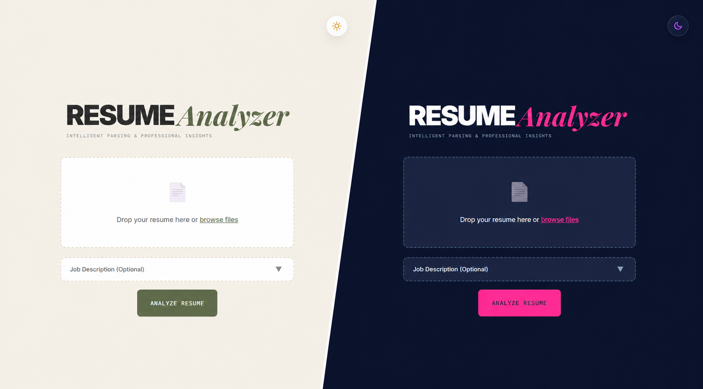

# AI Resume Analyzer & Career Intelligence Platform

An AI-powered resume intelligence platform that performs:

- layout-aware resume extraction
- structured semantic parsing
- AI-driven resume enhancement
- ATS optimization
- LaTeX resume generation
- career analysis and role recommendations

Built using Flask, React, Groq-hosted LLMs, PyMuPDF, OCR pipelines, and a modular semantic processing architecture.

---

# Overview

This project is designed as a **document intelligence pipeline**, not just a resume parser.

The platform converts unstructured resumes into structured semantic representations, analyzes weaknesses, selectively enhances content, and generates professionally rendered ATS-friendly resumes.

The system emphasizes:

- structure preservation
- selective enhancement
- deterministic processing
- modular architecture
- reusable semantic layers

---

# Core Capabilities

## Resume Extraction

Supports:

- PDF resumes
- scanned resumes
- image-based resumes

Extraction pipeline includes:

- layout-aware parsing using PyMuPDF
- OCR fallback using Tesseract
- typography-based section detection
- semantic block reconstruction
- structured identity extraction

---

## Structured Resume Schema

The platform converts resumes into canonical JSON objects.

Features:

- schema normalization
- schema validation
- automatic repair utilities
- versioned resume objects
- safe structured LLM outputs

---

## AI Resume Analysis

The analysis engine generates:

- professional summaries
- section-level scoring
- ATS keyword extraction
- strengths and weaknesses
- improvement priorities
- realistic role recommendations

---

## Selective Resume Enhancement

Unlike traditional resume tools, this platform avoids rewriting the entire resume.

The enhancement engine:

- preserves strong content
- rewrites only weak sections
- improves action verbs
- enhances quantified impact
- optimizes ATS phrasing
- maintains factual integrity

---

## Career Intelligence System

The platform includes career guidance capabilities such as:

- role alignment analysis
- realistic career path recommendations
- skill gap detection
- growth trajectory planning
- future extensibility for market intelligence

---

## Rendering Engine

The rendering layer converts structured resume JSON into production-ready LaTeX resumes.

Features:

- ATS-friendly formatting
- automatic LaTeX escaping
- editable `.tex` export
- automatic PDF compilation
- downloadable `.pdf` and `.tex` outputs

---

## Frontend Dashboard

Interactive React dashboard featuring:

- drag-and-drop uploads
- analytics dashboard
- section score visualization
- improvement insights
- resume preview
- downloadable assets

---

# System Pipeline

```text
Resume Upload
(PDF / PNG / JPG)
        ↓
Layout-Aware Extraction
        ↓
Structured Resume JSON (v1)
        ↓
Validation & Repair
        ↓
LLM Analysis + Enhancement
        ↓
Enhanced Resume JSON (v2)
        ↓
Career Intelligence Layer
        ↓
LaTeX Rendering Engine
        ↓
PDF Compilation
        ↓
Downloadable Resume Package
```

## Pipeline Data Flow & CLI Workflows

This section outlines how data moves sequentially through the pipeline, from raw files to final PDFs and live job listings, and how you can trigger or inspect each stage using terminal workflows.

### 1. Document Extraction & Parsing
* **Data Flow**: The uploaded resume (PDF/Image/Text) is parsed in `backend/services/extraction/pdf_extractor.py`. It runs a layout-aware extraction using PyMuPDF (or OCR fallback using Tesseract) and formats the text into a version 1 schema structure with extracted `identity`, `experience`, and `projects`.
* **CLI Testing**: You can test the prompt context creation and formatting from your terminal:
  ```bash
  python -X utf8 scratch/test_prompt_context.py
  ```

### 2. LLM-Based Analysis & Enhancement
* **Data Flow**: The Flask server sends the parsed v1 schema plus the job description (if provided) to the LLM via `backend/services/model_service/operations/llm_call.py`. The LLM evaluates resume weaknesses, rewrites weak action bullets, performs competitive career gap checks, and returns a verified v2 schema with full `analysis` metrics.
* **CLI Testing (cURL)**: You can mock a resume upload and analysis pass from the command line:
  ```bash
  curl -X POST http://localhost:5000/upload \
    -F "file=@/path/to/resume.pdf" \
    -F "jd_text=Looking for a Python Developer with Docker experience."
  ```

### 3. Caching
* **Data Flow**: The analysis result is cached inside `backend/services/caching/cache_service.py` under the `backend/cache/` directory, using a unique SHA-256 hash derived from the resume file content and job description. Subsequent requests resolve instantly from the cache, reducing API latency and LLM costs.

### 4. Live Job Matching & Currency Normalization
* **Data Flow**: When filters are set in the UI, `backend/services/jobs/job_search_service.py` is invoked. It generates an LLM-assisted search query, pulls live jobs from the web, and detects/parses global salary values (USD, GBP, EUR, AUD, CAD, SGD, AED, INR). It converts all figures into a unified Lakhs Per Annum (LPA) equivalent to rank matching relevance.
* **CLI Testing**:
  * Run the salary bounds parser and currency converter against multiple formats:
    ```bash
    python -X utf8 scratch/test_salary.py
    ```
  * Trigger a manual job search check via cURL:
    ```bash
    curl -X POST http://localhost:5000/find-jobs \
      -H "Content-Type: application/json" \
      -d '{"analysis_data": {"skills": {"technical": ["python", "flask"]}}, "filters": {"locations": ["Remote"], "salaryMin": "80"}}'
    ```

### 5. LaTeX Rendering & PDF Generation
* **Data Flow**: The enhanced resume JSON is mapped into standard LaTeX templates in `backend/services/rendering/renderer.py`. The backend runs local `pdflatex` compilation to output a beautifully formatted, ATS-compliant PDF along with the raw editable `.tex` code in the `backend/generated/` folder.

---

# Architecture

```text
Frontend (React + Vite)
        ↓
Flask API Layer
        ↓
Extraction Pipeline
        ↓
Semantic Processing Layer
        ↓
LLM Processing Layer
        ↓
Enhancement Engine
        ↓
Rendering Engine
        ↓
Caching Layer
```

---

# Tech Stack

## Backend

- Python 3.11+
- Flask
- Flask-CORS

---

## Frontend

- React
- Vite
- Vanilla CSS

---

## AI & LLM Integration

- Groq API
- `openai/gpt-oss-120b`
- structured JSON prompting
- schema-constrained outputs

---

## PDF & OCR Processing

- PyMuPDF (`fitz`)
- pytesseract
- pdf2image

---

## Rendering

- LaTeX
- pdflatex
- MiKTeX / TeX Live

---

## Validation & Utilities

- jsonschema
- python-dotenv
- werkzeug

---

# Project Structure

```text
project_root/
│
├── app.py
├── requirements.txt
├── README.md
├── .gitignore
├── .env
│
├── frontend/
│   ├── src/
│   │   ├── components/
│   │   │   ├── common/
│   │   │   │   ├── JobFilters.jsx
│   │   │   │   └── JobMatchTable.jsx
│   │   │   └── ThemeToggle.jsx
│   │   ├── views/
│   │   │   ├── career/
│   │   │   └── FindJobsView.jsx
│   │   └── main.jsx
│   └── vite.config.js
│
├── backend/
│   ├── __init__.py
│   │
│   ├── services/
│   │   ├── __init__.py
│   │   │
│   │   ├── caching/
│   │   │   ├── __init__.py
│   │   │   └── cache_service.py
│   │   │
│   │   ├── extraction/
│   │   │   ├── __init__.py
│   │   │   ├── pdf_extractor.py
│   │   │   ├── json_utils.py
│   │   │   └── validator.py
│   │   │
│   │   ├── jobs/
│   │   │   ├── __init__.py
│   │   │   └── job_search_service.py
│   │   │
│   │   ├── model_service/
│   │   │   ├── __init__.py
│   │   │   ├── config/
│   │   │   │   ├── LLM_Models.py
│   │   │   │   ├── model_registry.py
│   │   │   │   └── capability_routing.py
│   │   │   ├── extractors/
│   │   │   └── operations/
│   │   │       └── llm_call.py
│   │   │
│   │   └── rendering/
│   │       ├── __init__.py
│   │       └── renderer.py
│   │
│   ├── uploads/
│   ├── cache/
│   └── generated/
│
└── images/
```
---

# SCREENSHOTS

## Landing Page


---

## Analysis Dashboard


---

## LaTeX Editor


---

## Professional Summary


---

## Career Progression Paths


---

## Interactive Career Graph


---

## Competitive Gap Analysis


---

## Live Job Market Matcher


# Installation

## Clone Repository

```bash
git clone https://github.com/vedant7735/ai-resume-analyzer-flask.git

cd ai-resume-analyzer-flask
```

---

## Create Virtual Environment

### Windows

```bash
python -m venv venv

venv\Scripts\activate
```

### Linux / macOS

```bash
python -m venv venv

source venv/bin/activate
```

---

## Install Dependencies

```bash
pip install -r requirements.txt
```

---

# Environment Variables

Create a `.env` file:

```env
GROQ_API_KEY=your_api_key_here
```

---

# Running the Backend

```bash
python app.py
```

Backend runs on:

```text
http://localhost:5000
```

---

# Running the Frontend

```bash
cd frontend

npm install

npm run dev
```

Frontend runs on:

```text
http://localhost:5173
```

---

# API Endpoints

## `POST /upload`

Uploads and analyzes resume files.

### Supported Formats

- `.pdf`
- `.png`
- `.jpg`
- `.jpeg`

### Returns

- structured analyzed resume JSON
- enhancement data
- scoring information

---

## `POST /enhance`

Generates:

- LaTeX resume
- downloadable PDF
- editable `.tex` file

---

## `GET /download-tex/<file_id>`

Downloads generated LaTeX file.

---

## `GET /download-pdf/<file_id>`

Downloads generated PDF resume.

---

# Caching System

The platform includes multi-layer caching:

- analysis cache
- enhancement cache
- render cache

Benefits:

- lower LLM costs
- reduced latency
- faster repeated processing

---

# Current Features

## Implemented

- PDF extraction
- OCR fallback
- layout-aware parsing
- structured resume schema
- AI analysis
- selective enhancement
- ATS scoring
- LaTeX generation
- PDF compilation
- React dashboard
- render caching
- downloadable assets

---

# Planned Improvements

- Resume ↔ Job Description matching
- Docker deployment
- Redis caching
- async job queues
- PostgreSQL persistence
- multiple LaTeX templates
- market intelligence integration
- competitive analysis
- career graph visualization
- CI/CD pipeline
- observability & monitoring
- Kubernetes deployment

---

# Security Notes

- uploaded files are processed temporarily
- API keys are stored using environment variables
- generated resumes may be cached locally
- LaTeX content is sanitized before rendering

---

# Current Limitations

- DOCX support is limited
- OCR accuracy depends on scan quality
- requires local `pdflatex`
- synchronous processing pipeline
- large resumes may increase latency

---

# Development Direction

This project is evolving toward a modular AI document intelligence platform with:

- multimodal extraction
- structured semantic processing
- AI-assisted enhancement
- career intelligence systems
- scalable rendering architecture

---

# Author

GitHub:

https://github.com/vedant7735

---

# License

This project is intended for:

- educational purposes
- experimentation
- internship projects
- portfolio development

---

# Acknowledgements

- Flask
- React
- Groq
- PyMuPDF
- Tesseract OCR
- LaTeX Project