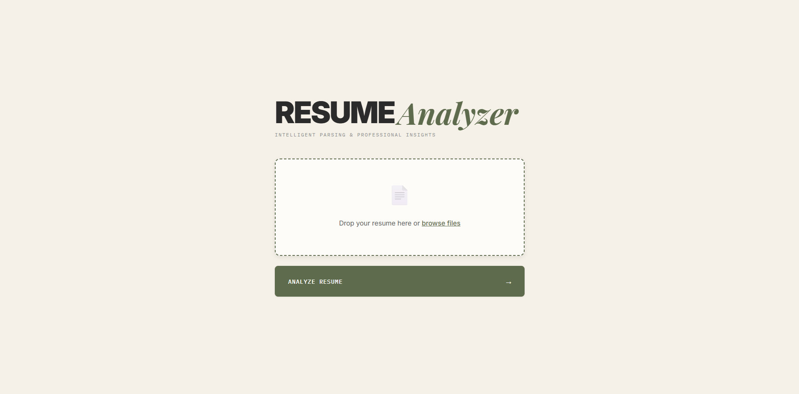
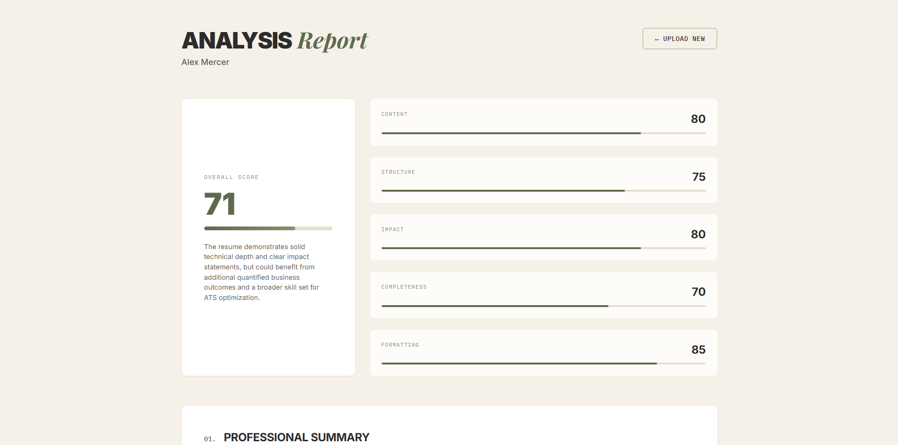
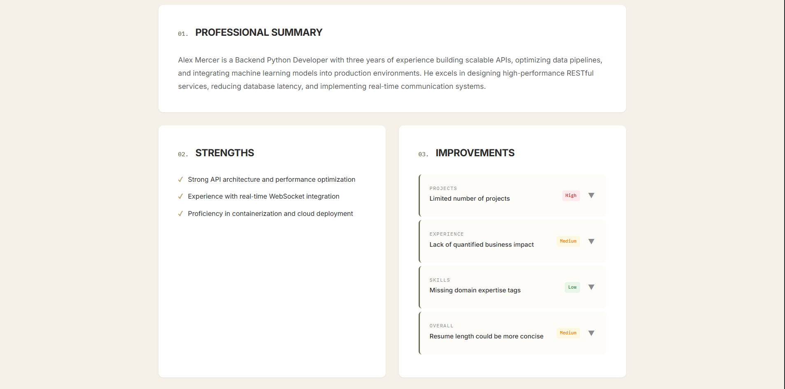
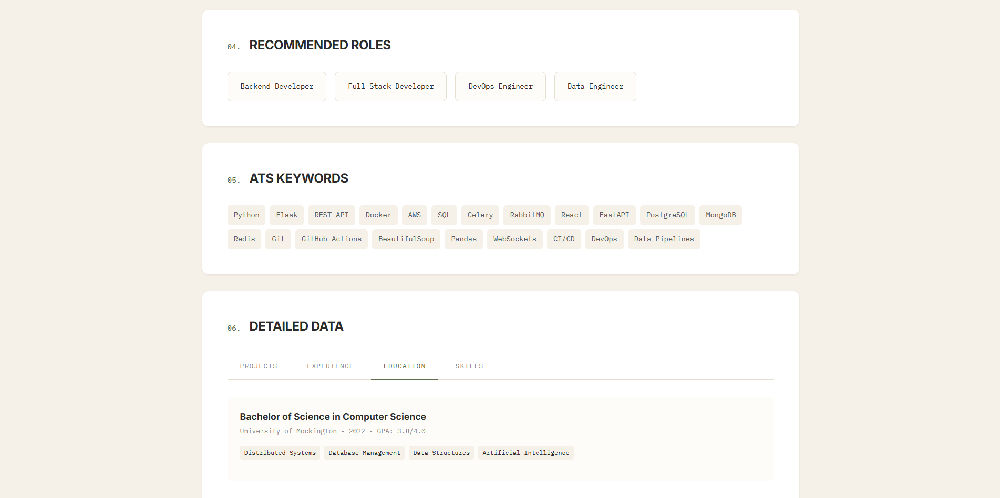

# README

## PROJECT OVERVIEW

This is an AI-powered resume analyzer that extracts text from PDF resumes, cleans the data, and uses a Language Model to provide comprehensive analysis including professional summaries, improvement suggestions, and scoring.

---

## FEATURES

- PDF text extraction using PyPDF2
- Text cleaning and normalization
- LLM-powered resume analysis
- Professional dashboard with scores and insights
- Improvement suggestions with priority levels
- ATS keyword extraction
- Recommended job roles
- Detailed data tabs for projects, experience, education, and skills

---

## TECH STACK

### Backend:
- Python 3.x
- Flask (web framework)
- Flask-CORS (cross-origin support)
- PyPDF2 (PDF text extraction)
- OpenAI API (LLM analysis)
- python-dotenv (environment variables)

### Frontend:
- HTML5
- CSS3 (custom design system)
- Vanilla JavaScript (no frameworks)

---

## INSTALLATION

1. Clone the repository
2. Create a virtual environment:
   ```bash
   python -m venv venv
   ```
3. Activate virtual environment:
   - Windows:
     ```bash
     venv\Scripts\activate
     ```
   - Mac/Linux:
     ```bash
     source venv/bin/activate
     ```
4. Install dependencies:
   ```bash
   pip install -r requirements.txt
   ```
5. Create a `.env` file in the root directory
6. Add your OpenAI API key to `.env`:
   ```env
   OPENAI_API_KEY=your_api_key_here
   ```

---

## DEPENDENCIES (`requirements.txt`)

```txt
Flask==2.3.0
flask-cors==4.0.0
PyPDF2==3.0.0
openai==1.0.0
python-dotenv==1.0.0
werkzeug==2.3.0
```

---

## PROJECT STRUCTURE

```txt
project_root/
├── app.py                  # Flask application
├── cleaner.py              # Text cleaning functions
├── .env                    # Environment variables (not in git)
├── requirements.txt        # Python dependencies
├── uploads/                # Temporary upload folder (auto-created)
└── templates/
    ├── index.html          # Main HTML file
    ├── styles.css          # Stylesheet
    └── script.js           # Frontend JavaScript
```

## SCREENSHOTS

### Landing Page



### Analysis Dashboard



### Summary



### Recommendations




---

## HOW TO RUN

1. Make sure virtual environment is activated
2. Run:
   ```bash
   python app.py
   ```
3. Open browser and go to:
   ```txt
   http://localhost:5000
   ```
4. Upload a PDF resume
5. Wait for analysis
6. View comprehensive dashboard

---

## USAGE

1. Drag and drop or click to select a PDF resume
2. Click **"ANALYZE RESUME"** button
3. Wait for processing (usually 5–15 seconds)
4. Dashboard appears with:
   - Overall score out of 100
   - Score breakdown (content, structure, impact, completeness, formatting)
   - Professional summary
   - Strengths list
   - Improvement suggestions (accordion style)
   - Recommended job roles
   - ATS keywords
   - Detailed data tabs
5. Click **"UPLOAD NEW"** to analyze another resume

---

## DESIGN SYSTEM

### Color Palette:
- Background: Warm cream/off-white (`#F5F1E8`)
- Text: Soft charcoal (`#2B2B2B`)
- Primary Accent: Muted olive (`#6B7A46`)
- Secondary Accent: Warm ochre (`#B59A52`)

### Typography:
- Headlines: Inter (heavy sans-serif) + Playfair Display (italic serif)
- Body: Inter (geometric sans-serif)
- UI Labels: IBM Plex Mono (monospaced)

---

## CONFIGURATION

You can adjust the LLM model in `app.py`:
- Default: `gpt-4o-mini` (faster, cheaper)
- Premium: `gpt-4o` (better quality)

---

## FEATURES BREAKDOWN

### 1. Text Extraction (`cleaner.py`)
- Fixes encoding issues
- Removes hyphenation artifacts
- Standardizes whitespace
- Normalizes bullet points
- Detects section headers

### 2. LLM Analysis (`app.py`)
- Structured JSON output
- Score calculation with breakdown
- Professional summary generation
- Strength identification
- Improvement suggestions with priority
- ATS keyword extraction
- Role recommendations

### 3. Dashboard (`index.html + styles.css + script.js`)
- Upload interface with drag-and-drop
- Loading states
- Error handling
- Score visualization with progress bars
- Accordion for improvements
- Tab navigation for detailed data
- Responsive design

---

## API ENDPOINTS

### `POST /upload`
- Accepts: `multipart/form-data` with `file` field
- Returns: JSON with analysis data
- Max file size: 16MB

### `GET /`
- Returns: Main HTML page

### `GET /styles.css`
- Returns: Stylesheet

---

## LIMITATIONS

- Only works with text-based PDFs (not scanned images)
- Requires OpenAI API key (costs money)
- File size limit: 16MB
- PDF format only
- Requires internet connection for LLM

---

## FUTURE ENHANCEMENTS

- Support for multiple file formats (DOCX, TXT)
- OCR for scanned PDFs
- Batch processing
- Export analysis as PDF report
- Compare multiple resumes
- Job description matching
- Resume template suggestions
- Version history tracking

---

## TROUBLESHOOTING

### Issue: File upload fails
**Solution:** Check file is PDF and under 16MB

### Issue: LLM analysis fails
**Solution:** Verify OpenAI API key in `.env` file and check API quota

### Issue: Blank dashboard
**Solution:** Check browser console for JavaScript errors

### Issue: CORS errors
**Solution:** Make sure Flask-CORS is installed and `CORS(app)` is in `app.py`

### Issue: Module not found
**Solution:** Activate virtual environment and run:
```bash
pip install -r requirements.txt
```

---

## SECURITY NOTES

- Uploaded files are deleted immediately after processing
- No data is stored permanently
- API keys stored in `.env` (not committed to git)
- Add `.env` to `.gitignore`
- CORS enabled (disable in production or restrict domains)

---

## LICENSE

This project is for educational/personal use.

---

## CREDITS

- PyPDF2 for PDF extraction
- OpenAI for LLM capabilities
- Google Fonts for typography (Inter, Playfair Display, IBM Plex Mono)

---

## CONTACT

For issues or questions, please open an issue in the repository.
