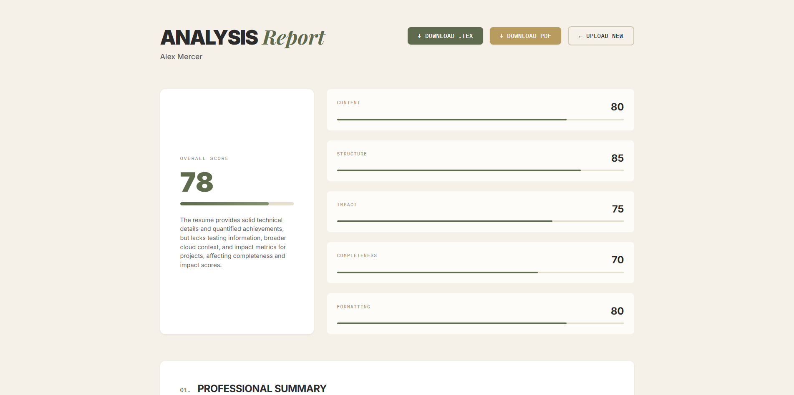
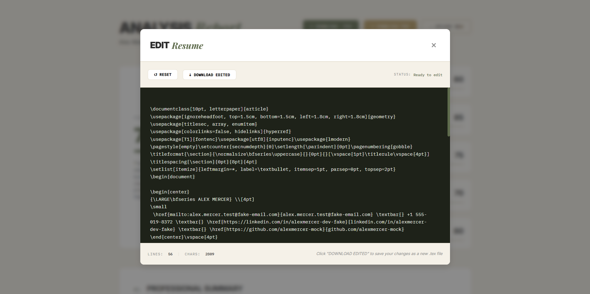

This file is a merged representation of the entire codebase, combined into a single document by Repomix.

# File Summary

## Purpose
This file contains a packed representation of the entire repository's contents.
It is designed to be easily consumable by AI systems for analysis, code review,
or other automated processes.

## File Format
The content is organized as follows:
1. This summary section
2. Repository information
3. Directory structure
4. Repository files (if enabled)
5. Multiple file entries, each consisting of:
  a. A header with the file path (## File: path/to/file)
  b. The full contents of the file in a code block

## Usage Guidelines
- This file should be treated as read-only. Any changes should be made to the
  original repository files, not this packed version.
- When processing this file, use the file path to distinguish
  between different files in the repository.
- Be aware that this file may contain sensitive information. Handle it with
  the same level of security as you would the original repository.

## Notes
- Some files may have been excluded based on .gitignore rules and Repomix's configuration
- Binary files are not included in this packed representation. Please refer to the Repository Structure section for a complete list of file paths, including binary files
- Files matching patterns in .gitignore are excluded
- Files matching default ignore patterns are excluded
- Files are sorted by Git change count (files with more changes are at the bottom)

# Directory Structure
```
app.py
images/v1/landing.png
images/v1/recommendation.png
images/v1/score.png
images/v1/summary.png
images/v2/landing.png
images/v2/recommendation.png
images/v2/score.png
images/v2/summary.png
images/v2/texeditor.png
PRD.md
README.md
requirements.txt
services/__init__.py
services/cache_service.py
services/json_utils.py
services/model_service/__init__.py
services/model_service/capability_routing.py
services/model_service/llm_analyzer.py
services/model_service/llm_enhancer.py
services/model_service/LLM_Models.py
services/model_service/model_registry.py
services/model_service/multimodal_extractor.py
services/pdf_extractor.py
services/renderer.py
services/validator.py
templates/index.html
templates/script.js
templates/styles.css
```

# Files

## File: PRD.md
````markdown
# 📋 Project Review Document: AI-Powered Resume Analyzer & Career Intelligence Platform

**Version:** 1.0  
**Date:** 2025  
**Status:** Pre-Development Review  
**Author:** Project Team  

---

## 📑 Table of Contents

1. [Executive Summary](#1-executive-summary)
2. [Project Overview](#2-project-overview)
3. [System Architecture](#3-system-architecture)
4. [Core Features](#4-core-features)
5. [Advanced Features](#5-advanced-features)
6. [LLM Integration & Prompts](#6-llm-integration--prompts)
7. [Technical Stack](#7-technical-stack)
8. [Implementation Phases](#8-implementation-phases)
9. [Success Metrics](#9-success-metrics)
10. [Risk Analysis](#10-risk-analysis)

---

## 1. Executive Summary

### 1.1 Project Vision

An intelligent resume analysis platform that combines **multimodal PDF/image extraction**, **selective AI enhancement**, and **proactive career intelligence** to help users create ATS-optimized resumes while discovering personalized career paths.

### 1.2 Key Differentiators

| Feature | Traditional Tools | Our Platform |
|---------|------------------|--------------|
| **Input** | Text/PDF only | PDF, Images (scanned resumes, screenshots) |
| **Enhancement** | Full rewrite | Selective (weak sections only) |
| **Structure** | Template-based | Preserves original LaTeX structure |
| **Career Guidance** | Job matching (user inputs JD) | Proactive path generation (LLM-driven) |
| **Editing** | Static preview | Dual-editable (LaTeX + Visual) |
| **Scoring** | 0-100 arbitrary | Contextual (HIGH/MODERATE/LOW) |

### 1.3 Target Users

- **Primary:** Mid-level professionals (3-7 years experience) seeking career growth
- **Secondary:** Recent graduates building first resume
- **Tertiary:** Career pivoters exploring alternative paths

---

## 2. Project Overview

### 2.1 Problem Statement

Existing resume tools suffer from:
1. **Poor structure preservation** - rewrites destroy original formatting
2. **Token inefficiency** - send entire resume to LLM unnecessarily
3. **Lack of actionable guidance** - generic scores without next steps
4. **Limited editing flexibility** - either raw LaTeX or locked templates

### 2.2 Solution Architecture

```
┌─────────────────────────────────────────────────────────┐
│                    USER UPLOADS RESUME                   │
│                    (PDF/PNG/JPG/JPEG)                    │
└────────────────────┬────────────────────────────────────┘
                     ↓
┌─────────────────────────────────────────────────────────┐
│              MULTIMODAL EXTRACTION LAYER                 │
│  ┌──────────────────┐         ┌──────────────────┐     │
│  │  PDF Extraction  │         │ Image Extraction │     │
│  │  PyMuPDF         │         │ Vision LLM       │     │
│  │  → LaTeX + JSON  │         │ → JSON directly  │     │
│  └──────────────────┘         └──────────────────┘     │
└────────────────────┬────────────────────────────────────┘
                     ↓
┌─────────────────────────────────────────────────────────┐
│                  STRUCTURED RESUME JSON                  │
│  { identity, experience, projects, education, skills }  │
└────────────────────┬────────────────────────────────────┘
                     ↓
┌─────────────────────────────────────────────────────────┐
│                    RESUME ANALYZER                       │
│  • Flags weak sections (projects, workshops, etc.)      │
│  • Scores each section (quantified metrics, verbs, etc.)│
│  • Identifies gaps and strengths                        │
└────────────────────┬────────────────────────────────────┘
                     ↓
            ┌────────┴────────┐
            ↓                 ↓
┌─────────────────┐  ┌─────────────────────────┐
│ LATEX TEMPLATE  │  │ SELECTIVE ENHANCEMENT   │
│ PREPARATION     │  │ ENGINE                  │
│                 │  │                         │
│ • Remove weak   │  │ • LLM enhances ONLY     │
│   sections      │  │   flagged sections      │
│ • Insert Node   │  │ • JSON → JSON           │
│   IDs           │  │ • Adds metrics, fixes   │
│ • Preserve rest │  │   weak verbs            │
└────────┬────────┘  └──────────┬──────────────┘
         │                      │
         └──────────┬───────────┘
                    ↓
         ┌──────────────────────┐
         │ JSON → LATEX         │
         │ CONVERTER            │
         │                      │
         │ Enhanced sections    │
         │ → LaTeX code         │
         └──────────┬───────────┘
                    ↓
         ┌──────────────────────┐
         │ LATEX INTEGRATION    │
         │                      │
         │ Replace Node IDs     │
         │ with enhanced LaTeX  │
         └──────────┬───────────┘
                    ↓
         ┌──────────────────────┐
         │ HYBRID EDITOR        │
         │ ┌────────┬─────────┐ │
         │ │ LaTeX  │ Visual  │ │
         │ │ Editor │ Preview │ │
         │ └────────┴─────────┘ │
         │   [Compile PDF]      │
         └──────────┬───────────┘
                    ↓
         ┌──────────────────────┐
         │ FINAL ENHANCED       │
         │ RESUME               │
         │ (.tex, .pdf)         │
         └──────────────────────┘
```

---

## 3. System Architecture

### 3.1 Pipeline Components

#### **Stage 1: Multimodal Extraction**

**Input Types:**
- PDF (text-based)
- PDF (scanned/image-based)
- PNG/JPG/JPEG (screenshots, phone photos)

**Extraction Logic:**
```python
def extract_resume(file_path, file_type):
    if file_type == 'pdf':
        # Check if PDF has extractable text
        text_content = quick_text_check(file_path)
        
        if len(text_content) > 100:
            # Text-based PDF → dual extraction
            return extract_pdf_dual(file_path)
        else:
            # Scanned PDF → vision LLM
            return extract_with_vision_llm(file_path)
    
    elif file_type in ['png', 'jpg', 'jpeg']:
        # Image → vision LLM
        return extract_with_vision_llm(file_path)

def extract_pdf_dual(pdf_path):
    """Returns (base_latex, json_content)"""
    # PyMuPDF extraction preserving layout
    base_latex = pdf_to_latex_preserving_structure(pdf_path)
    json_content = pdf_to_canonical_json(pdf_path)
    return base_latex, json_content

def extract_with_vision_llm(file_path):
    """Returns json_content only (no LaTeX preservation)"""
    # Send image to vision LLM with structured output prompt
    json_content = vision_llm.extract_resume_json(file_path)
    return None, json_content  # No base LaTeX for images
```

#### **Stage 2: Resume Analyzer**

**Analysis Criteria:**

| Section | Scoring Factors | Weak Threshold |
|---------|----------------|----------------|
| **Projects** | Quantified metrics, tech stack clarity, impact statements | < 60/100 |
| **Experience** | Action verbs, scope/scale, achievements vs duties | < 65/100 |
| **Workshops** | Descriptions, outcomes, relevance | < 50/100 |
| **Summary** | Conciseness, value prop, specificity | < 70/100 |

**Scoring Algorithm:**
```python
def score_section(section_name, content):
    score = 0
    
    # Factor 1: Quantified Metrics (20 points)
    metrics_found = len(re.findall(r'\d+%|\d+x|\d+\+|improved|reduced', content))
    score += min(metrics_found * 5, 20)
    
    # Factor 2: Strong Action Verbs (20 points)
    strong_verbs = ['architected', 'designed', 'built', 'optimized', 'implemented']
    weak_verbs = ['worked on', 'helped with', 'responsible for']
    
    strong_count = sum(1 for v in strong_verbs if v in content.lower())
    weak_count = sum(1 for v in weak_verbs if v in content.lower())
    
    score += strong_count * 5
    score -= weak_count * 3
    
    # Factor 3: Detail/Length (20 points)
    bullet_count = content.count('\item')
    if bullet_count >= 4: score += 20
    elif bullet_count >= 2: score += 10
    
    # Factor 4: Technical Depth (20 points)
    tech_keywords = ['api', 'database', 'system', 'architecture', 'pipeline']
    tech_count = sum(1 for kw in tech_keywords if kw in content.lower())
    score += min(tech_count * 5, 20)
    
    # Factor 5: Formatting Quality (20 points)
    if r'\begin{itemize}' in content and r'\end{itemize}' in content:
        score += 20
    
    return max(0, min(score, 100))
```

#### **Stage 3: Node ID System**

**Placeholder Generation:**
```latex
% Original LaTeX
\section{Projects}
\noindent\textbf{Project Alpha}
\begin{itemize}
  \item Built a web scraper
  \item Processed data
\end{itemize}

% After removal (weak section detected)
%%NODE_PROJECTS_001%%

% After enhancement (replaced)
\section{Projects}
\noindent\textbf{Project Alpha} \hfill \texttt{\small 2023}
\texttt{\small Python, BeautifulSoup, Pandas}
\begin{itemize}
  \item Built a high-performance web scraper processing 1M records/day
  \item Reduced data processing time by 45% via parallel execution
\end{itemize}
```

**Node ID Mapping:**
```python
class NodeIDManager:
    def __init__(self):
        self.node_map = {}  # {node_id: (section_name, original_content, line_range)}
    
    def create_node(self, section_name, original_latex, start_line, end_line):
        node_id = f"NODE_{section_name.upper()}_{uuid.uuid4().hex[:6]}"
        self.node_map[node_id] = {
            "section": section_name,
            "original": original_latex,
            "lines": (start_line, end_line)
        }
        return f"%%{node_id}%%"
    
    def replace_node(self, node_id, enhanced_latex):
        if node_id not in self.node_map:
            raise ValueError(f"Node {node_id} not found")
        
        return enhanced_latex
```

---

## 4. Core Features

### 4.1 Hybrid Editor System

#### **Architecture:**

```
┌──────────────────────────────────────────────────────────┐
│              Hybrid Resume Editor                        │
├───────────────────────┬──────────────────────────────────┤
│  LaTeX Editor         │  Visual Preview                  │
│  (Monaco Editor)      │  (Structured Contenteditable)    │
├───────────────────────┼──────────────────────────────────┤
│ \documentclass[10pt]  │  ┌────────────────────────────┐  │
│ \begin{document}      │  │ JOHN DOE                   │  │
│                       │  │ john@email.com | GitHub    │  │
│ % Header              │  └────────────────────────────┘  │
│ \section{Experience}  │                                  │
│                       │  EXPERIENCE                      │
│ \textbf{SE II}        │  Software Engineer II            │
│ FakeCorp              │  FakeCorp | 2022 - Present       │
│                       │  [Click company to edit]         │
│ \begin{itemize}       │                                  │
│   \item Built API     │  • Built API serving 50k req/day │
│   \item Reduced...    │    [Click to edit bullet]        │
│ \end{itemize}         │  • Reduced latency by 40%        │
│                       │    [Click to edit bullet]        │
│ [Line 42]             │                                  │
│ [Changes detected]    │  ℹ️ Add sections in LaTeX editor │
└───────────────────────┴──────────────────────────────────┘
   ↑ Full editing power    ↑ Text-only editing             
                                                            
                [Compile to PDF] [↓ Download .tex/.pdf]
```

#### **Editing Rules:**

| Action | LaTeX Editor | Visual Preview |
|--------|-------------|----------------|
| Edit job title | ✅ Direct | ✅ Click to edit |
| Edit bullet text | ✅ Direct | ✅ Click to edit |
| Change formatting (bold/italic) | ✅ Direct | ❌ Use LaTeX |
| Add new section | ✅ Direct | ❌ Use LaTeX |
| Reorder sections | ✅ Cut/paste | ❌ Use LaTeX |
| Change margins/spacing | ✅ Direct | ❌ Use LaTeX |

#### **Sync Mechanism:**

```javascript
// Visual Preview → LaTeX Editor sync
class EditorSync {
  constructor(latexEditor, visualPreview) {
    this.latexEditor = latexEditor;
    this.visualPreview = visualPreview;
    this.nodeMap = {}; // Maps DOM elements to LaTeX line numbers
  }
  
  onVisualEdit(element, newValue) {
    const latexLocation = this.nodeMap[element.dataset.nodeId];
    
    if (!latexLocation) {
      console.error('No LaTeX mapping for element');
      return;
    }
    
    // Update LaTeX at specific line
    const lines = this.latexEditor.getValue().split('\n');
    const { lineNum, pattern } = latexLocation;
    
    lines[lineNum] = lines[lineNum].replace(
      pattern,
      (match) => match.replace(/\{(.*?)\}/, `{${escapeLatex(newValue)}}`)
    );
    
    this.latexEditor.setValue(lines.join('\n'));
    this.markNeedsCompile();
  }
  
  buildNodeMap(latexSource) {
    // Parse LaTeX and create mapping
    const lines = latexSource.split('\n');
    
    lines.forEach((line, idx) => {
      // Map \textbf{...} to editable elements
      if (line.includes('\\textbf{')) {
        const nodeId = `title_${idx}`;
        this.nodeMap[nodeId] = {
          lineNum: idx,
          pattern: /\\textbf\{(.*?)\}/
        };
      }
      
      // Map \item ... to bullet elements
      if (line.trim().startsWith('\\item')) {
        const nodeId = `bullet_${idx}`;
        this.nodeMap[nodeId] = {
          lineNum: idx,
          pattern: /\\item (.*)/
        };
      }
    });
  }
}
```

#### **Compilation Strategy:**

**Manual Compile Button (Not Live)**

```python
# Backend: MiKTeX Compilation
@app.route('/api/compile', methods=['POST'])
def compile_latex():
    latex_code = request.json['latex']
    
    # Create temp directory
    file_id = str(uuid.uuid4())
    temp_dir = f'temp/{file_id}'
    os.makedirs(temp_dir, exist_ok=True)
    
    tex_path = os.path.join(temp_dir, 'resume.tex')
    with open(tex_path, 'w', encoding='utf-8') as f:
        f.write(latex_code)
    
    # Compile with MiKTeX (local, fast)
    result = subprocess.run(
        ['pdflatex', '-interaction=nonstopmode', 'resume.tex'],
        cwd=temp_dir,
        capture_output=True,
        timeout=15
    )
    
    pdf_path = os.path.join(temp_dir, 'resume.pdf')
    
    if result.returncode == 0 and os.path.exists(pdf_path):
        return send_file(pdf_path, mimetype='application/pdf')
    else:
        # Parse error log
        log_path = os.path.join(temp_dir, 'resume.log')
        error_info = parse_latex_error_log(log_path)
        
        return jsonify({
            'error': 'Compilation failed',
            'line': error_info['line'],
            'message': error_info['message']
        }), 400

def parse_latex_error_log(log_path):
    """Extract error line and message from .log file"""
    with open(log_path, 'r', encoding='utf-8', errors='ignore') as f:
        log = f.read()
    
    # Pattern: ! Error message \n l.42
    match = re.search(r'! (.*?)\nl\.(\d+) (.*)', log)
    if match:
        return {
            'message': match.group(1),
            'line': int(match.group(2)),
            'context': match.group(3)
        }
    
    return {'message': 'Unknown error', 'line': None, 'context': ''}
```

**Frontend: Compile Button UI**

```javascript
document.getElementById('compileBtn').addEventListener('click', async () => {
  const latexCode = latexEditor.getValue();
  
  // Show loading state
  setCompileState('compiling');
  
  try {
    const response = await fetch('/api/compile', {
      method: 'POST',
      headers: { 'Content-Type': 'application/json' },
      body: JSON.stringify({ latex: latexCode })
    });
    
    if (response.ok) {
      const pdfBlob = await response.blob();
      displayPdfPreview(pdfBlob);
      setCompileState('success');
    } else {
      const error = await response.json();
      highlightErrorLine(error.line);
      showErrorMessage(error.message);
      setCompileState('error');
    }
  } catch (err) {
    setCompileState('error');
    showErrorMessage('Compilation failed: ' + err.message);
  }
});

function setCompileState(state) {
  const btn = document.getElementById('compileBtn');
  
  if (state === 'compiling') {
    btn.disabled = true;
    btn.innerHTML = '⏳ Compiling...';
  } else if (state === 'success') {
    btn.disabled = false;
    btn.innerHTML = '✓ Compiled';
    setTimeout(() => {
      btn.innerHTML = '🔄 Compile PDF';
    }, 2000);
  } else if (state === 'error') {
    btn.disabled = false;
    btn.innerHTML = '❌ Error - Fix & Retry';
  }
}

function highlightErrorLine(lineNum) {
  latexEditor.deltaDecorations([], [{
    range: new monaco.Range(lineNum, 1, lineNum, 1),
    options: {
      isWholeLine: true,
      className: 'error-line-highlight',
      glyphMarginClassName: 'error-glyph',
      hoverMessage: { value: 'LaTeX compilation error on this line' }
    }
  }]);
}
```

---

## 5. Advanced Features

### 5.1 Career Paths Dashboard

#### **Overview:**

Proactive career intelligence system that generates 3-5 personalized career paths based on resume analysis **without user input**.

#### **Architecture:**

```
Resume JSON
    ↓
Profile Classifier (LLM)
    ↓
{
  "current_level": "Mid-level",
  "primary_domain": "Backend Engineering",
  "years_experience": 3,
  "key_skills": ["Python", "AWS", "System Design"],
  "education_level": "Bachelor's",
  "project_complexity": "Production-scale",
  "leadership_indicators": "Low"
}
    ↓
Career Path Generator (LLM)
    ↓
Generates 3-5 Paths:
├─ Path 1: Ready Now (90%+ alignment)
├─ Path 2: Growth Path (70-80% alignment)
├─ Path 3: Stretch Goal (60-70% alignment)
├─ Path 4: Pivot Option (40-50% alignment)
└─ Path 5: Alternative Track (specialist vs generalist)
    ↓
For Each Path:
├─ Ideal job requirements
├─ Gap analysis
├─ Actionable next steps
└─ Time-to-ready estimate
```

#### **UI/UX Design:**

```
┌─────────────────────────────────────────────────────────┐
│  🎯 Career Paths for Your Profile                      │
│  Based on 3 years Backend Engineering experience       │
└─────────────────────────────────────────────────────────┘

┌─────────────────────────────────────────────────────────┐
│ ✅ READY NOW                                            │
│ Senior Backend Engineer (Python/AWS)                    │
│ Alignment: HIGH (92%)                                   │
│                                                         │
│ ✓ You have:                                             │
│   • 3 years production Python experience                │
│   • AWS cloud deployment knowledge                      │
│   • RESTful API design & optimization                   │
│   • Performance tuning & caching                        │
│                                                         │
│ Minor gaps:                                             │
│   ⚠ Show more system design examples (add 1-2 bullets) │
│   ⚠ Highlight any mentoring/code review                │
│                                                         │
│ Next steps:                                             │
│   1. Emphasize architecture decisions in project bullets│
│   2. Add "Mentored junior developers" if applicable     │
│   3. Ready to apply immediately                         │
│                                                         │
│ [Apply with Confidence] [View Similar Roles]            │
└─────────────────────────────────────────────────────────┘

┌─────────────────────────────────────────────────────────┐
│ 🎯 GROWTH PATH (6-12 months)                            │
│ Staff Engineer (Individual Contributor Track)          │
│ Alignment: MODERATE (74%)                               │
│                                                         │
│ What you need:                                          │
│   ⚠ 2 more years senior-level experience                │
│   ⚠ Technical leadership examples needed                │
│   ⚠ Cross-team influence / architecture proposals       │
│   ⚠ Published technical writing or talks                │
│                                                         │
│ Transition roadmap:                                     │
│   1. Take ownership of system architecture (3-6 months) │
│   2. Write technical design docs & RFC proposals        │
│   3. Mentor 2-3 engineers, document impact              │
│   4. Publish 1-2 technical blog posts                   │
│   5. Lead cross-team initiative                         │
│                                                         │
│ Time to ready: 8-12 months                              │
│                                                         │
│ [View Detailed Roadmap] [Find Resources]                │
└─────────────────────────────────────────────────────────┘

┌─────────────────────────────────────────────────────────┐
│ 🚀 STRETCH GOAL (12-18 months)                          │
│ Engineering Manager                                     │
│ Alignment: MODERATE (68%)                               │
│                                                         │
│ Why this is a stretch:                                  │
│   ✗ No management experience shown                      │
│   ✗ Need people leadership track record                 │
│   ⚠ Limited cross-functional collaboration examples     │
│                                                         │
│ Transition strategy:                                    │
│   1. Become tech lead of your team (6 months)           │
│   2. Manage 1-2 interns or junior devs                  │
│   3. Run sprint planning & retrospectives               │
│   4. Take management training course                    │
│   5. Shadow current managers, seek mentorship           │
│                                                         │
│ Time to ready: 12-18 months                             │
│                                                         │
│ [See Management Resources] [Talk to Mentors]            │
└─────────────────────────────────────────────────────────┘

┌─────────────────────────────────────────────────────────┐
│ 🔄 PIVOT OPTION (18-24 months)                          │
│ Machine Learning Engineer                               │
│ Alignment: LOW (52%)                                    │
│                                                         │
│ Transferable strengths:                                 │
│   ✓ Strong Python foundation                            │
│   ✓ Data pipeline & processing experience               │
│   ✓ System optimization skills                          │
│                                                         │
│ Major gaps:                                             │
│   ✗ No ML/AI project experience                         │
│   ✗ Missing: TensorFlow, PyTorch, Scikit-learn          │
│   ✗ Lacks statistics/linear algebra background          │
│   ✗ No model training or deployment examples            │
│                                                         │
│ Full transition plan:                                   │
│   Phase 1 (0-6 months): Learn fundamentals              │
│     • Complete ML course (Fast.ai or Coursera)          │
│     • Study linear algebra & statistics                 │
│   Phase 2 (6-12 months): Build portfolio                │
│     • 3-4 ML projects (Kaggle, personal datasets)       │
│     • Contribute to open-source ML libraries            │
│   Phase 3 (12-18 months): Transition role               │
│     • Target "ML Engineer (Junior)" or hybrid role      │
│     • Leverage backend experience for MLOps/pipelines   │
│   Phase 4 (18-24 months): Full ML role                  │
│                                                         │
│ Time to ready: 18-24 months                             │
│ Difficulty: HIGH (career pivot)                         │
│                                                         │
│ [Explore Learning Path] [Find Courses] [Join Community] │
└─────────────────────────────────────────────────────────┘

┌─────────────────────────────────────────────────────────┐
│ 🛤️ ALTERNATIVE TRACK                                    │
│ DevOps/Platform Engineer                                │
│ Alignment: MODERATE (71%)                               │
│                                                         │
│ Why this fits:                                          │
│   ✓ AWS experience (strong foundation)                  │
│   ✓ System design & optimization skills                 │
│   ⚠ Need more infrastructure-as-code examples           │
│                                                         │
│ Skills to add:                                          │
│   • Kubernetes, Docker (containerization)               │
│   • Terraform or Ansible (IaC)                          │
│   • CI/CD pipeline design                               │
│   • Monitoring & observability (Prometheus, Grafana)    │
│                                                         │
│ Quick wins:                                             │
│   1. Dockerize your existing projects                   │
│   2. Set up CI/CD for side project                      │
│   3. Get CKA (Certified Kubernetes Admin)               │
│                                                         │
│ Time to ready: 6-9 months                               │
│                                                         │
│ [View DevOps Roadmap] [Certification Prep]              │
└─────────────────────────────────────────────────────────┘
```

---

### 5.2 Advanced Feature 1: Dynamic Career Graph

#### **Visual Representation:**

```
Current Position: Software Engineer II (Backend)
        │
        ├─────────────────────────────────────────┐
        │                                         │
   [1 Year]                                  [1 Year]
        │                                         │
        ↓                                         ↓
┌───────────────────┐                  ┌──────────────────┐
│ Senior Backend    │  Probability:    │ Full Stack       │
│ Engineer          │  HIGH (85%)      │ Engineer         │
└────────┬──────────┘                  └─────────┬────────┘
         │                                       │
    [2-3 Years]                            [2-3 Years]
         │                                       │
         ├───────────────┬───────────────────────┤
         ↓               ↓                       ↓
┌─────────────┐  ┌──────────────┐     ┌─────────────────┐
│ Staff       │  │ Engineering  │     │ Solutions       │
│ Engineer    │  │ Manager      │     │ Architect       │
│ (IC Track)  │  │ (Mgmt Track) │     │ (Specialist)    │
└─────────────┘  └──────────────┘     └─────────────────┘
  Probability:     Probability:         Probability:
  HIGH (75%)       MODERATE (60%)       MODERATE (65%)
```

#### **Implementation:**

**Data Structure:**
```json
{
  "career_graph": {
    "current_node": {
      "title": "Software Engineer II",
      "level": "Mid",
      "tenure": "3 years"
    },
    "paths": [
      {
        "timeframe": "1 year",
        "options": [
          {
            "title": "Senior Backend Engineer",
            "probability": "HIGH",
            "probability_score": 85,
            "why": "Strong technical foundation, needs minor leadership examples"
          },
          {
            "title": "Full Stack Engineer",
            "probability": "MODERATE",
            "probability_score": 65,
            "why": "Backend strong, need frontend skill development"
          }
        ]
      },
      {
        "timeframe": "3 years",
        "from": "Senior Backend Engineer",
        "options": [
          {
            "title": "Staff Engineer",
            "track": "IC",
            "probability": "HIGH",
            "probability_score": 75
          },
          {
            "title": "Engineering Manager",
            "track": "Management",
            "probability": "MODERATE",
            "probability_score": 60
          }
        ]
      }
    ]
  }
}
```

**Visualization:** Use **D3.js** or **React Flow** for interactive graph.

---

### 5.3 Advanced Feature 2: Market Intelligence (Optional)

#### **Integration Points:**

```python
# Optional: LinkedIn/Indeed API integration
def fetch_market_data(role_title):
    """
    Query job market APIs for:
    - Number of open positions
    - Salary ranges
    - Top hiring companies
    - Trending skills
    - Remote availability %
    """
    
    # Example with hypothetical API
    response = job_market_api.query({
        "title": role_title,
        "region": "United States",
        "time_range": "last_30_days"
    })
    
    return {
        "demand": categorize_demand(response['open_positions']),
        "avg_salary": response['salary_range'],
        "top_companies": response['top_employers'][:5],
        "trending_skills": response['skill_frequency'][:10],
        "remote_pct": response['remote_percentage']
    }

def categorize_demand(position_count):
    if position_count > 5000:
        return "HIGH"
    elif position_count > 1000:
        return "MODERATE"
    else:
        return "LOW"
```

#### **UI Display:**

```
Senior Backend Engineer
├─ 📊 Market Demand: HIGH (8,400 open roles)
├─ 💰 Salary Range: $130k - $180k (median: $155k)
├─ 🏢 Top Hiring: Google, Meta, Stripe, Coinbase, Netflix
├─ 📈 Trending Skills: 
│   • Kubernetes (+52% in job postings)
│   • Go (+38%)
│   • gRPC (+29%)
│   • PostgreSQL (stable)
├─ 🌍 Remote-Friendly: 82% of postings
└─ 📍 Top Locations: SF Bay Area, NYC, Seattle, Austin
```

---

### 5.4 Advanced Feature 3: Competitive Analysis

#### **Concept:**

Compare user's resume against **aggregated anonymous data** from similar profiles.

```
┌─────────────────────────────────────────────────────────┐
│ 📊 Competitive Analysis                                 │
│ Compared to 1,247 Senior Backend Engineers              │
└─────────────────────────────────────────────────────────┘

Your Strengths (Top 20%):
✓ AWS experience & cloud architecture
✓ Data pipeline design
✓ Performance optimization

Common Strengths You Lack (Bottom 40%):
⚠ Kubernetes/container orchestration (68% of peers have this)
⚠ gRPC/protocol buffers (54% of peers)
⚠ Open-source contributions (47% of peers)

Your Unique Differentiators:
🌟 ML pipeline integration (only 12% have this)
🌟 Data engineering hybrid background (rare)

Recommendation:
Focus on Kubernetes to close gap with peers, while emphasizing
your ML+Backend hybrid expertise as a unique positioning.

Consider roles like:
• ML Infrastructure Engineer
• Data Platform Engineer
• Backend Engineer (ML-focused teams)
```

#### **Data Privacy:**

- **No individual data stored** - only aggregate statistics
- **Anonymized comparisons** - no user-to-user matching
- **Opt-in only** - users choose to see competitive analysis

---

## 6. LLM Integration & Prompts

### 6.1 Prompt Architecture

All LLM calls use **structured output** with **canonical JSON schemas** for deterministic parsing.

---

### 6.2 Prompt 1: Vision LLM - Image Resume Extraction

**Model:** GPT-4 Vision / Gemini Vision  
**Purpose:** Extract resume from image (screenshot, photo, scanned PDF)  
**Input:** Image file  
**Output:** Canonical resume JSON  

```python
VISION_EXTRACTION_PROMPT = """
You are a resume extraction specialist. Analyze the provided resume image and extract ALL information into structured JSON.

OUTPUT SCHEMA (strict):
{
  "resume_id": "generated_uuid",
  "schema_version": "1.0",
  "identity": {
    "name": "Full name in original case",
    "email": "email@domain.com",
    "phone": "+1234567890 or original format",
    "linkedin": "linkedin.com/in/username (if visible)",
    "github": "github.com/username (if visible)",
    "portfolio": "website.com (if visible)",
    "location": "City, State/Country (if visible)"
  },
  "summary": "Professional summary text or empty string",
  "experience": [
    {
      "title": "Job Title",
      "company": "Company Name",
      "location": "City, State (if shown)",
      "duration": "Month Year - Month Year or Present",
      "type": "Full-time/Internship/Contract (if shown, else empty)",
      "bullets": [
        "First responsibility/achievement",
        "Second responsibility/achievement"
      ]
    }
  ],
  "projects": [
    {
      "title": "Project Name",
      "type": "Personal/Academic/Research (if shown)",
      "year": "2023 or date range",
      "tech_stack": ["Python", "Flask", "AWS"],
      "bullets": [
        "Project description or achievement"
      ]
    }
  ],
  "education": [
    {
      "degree": "Bachelor of Science",
      "major": "Computer Science",
      "institution": "University Name",
      "location": "City, State (if shown)",
      "graduation_year": "2022",
      "gpa": "3.8/4.0 (if shown, else empty)",
      "relevant_coursework": ["Course 1", "Course 2"] or []
    }
  ],
  "workshops": [
    {
      "title": "Workshop/Training Name",
      "year": "2023",
      "description": "Brief description (if available)"
    }
  ],
  "skills": {
    "languages": ["Python", "JavaScript"],
    "frameworks": ["React", "Flask"],
    "tools": ["Git", "Docker"],
    "domains": ["Backend", "Data Engineering"]
  }
}

EXTRACTION RULES:
1. Extract text EXACTLY as written - preserve capitalization, spelling
2. If information is unclear/illegible, use empty string or empty array
3. Do NOT invent or hallucinate information not visible in image
4. If resume has unusual format, do your best to map to schema
5. For bullet points, preserve original wording
6. Return ONLY valid JSON - no markdown, no explanations

IMAGE PROVIDED: [Resume screenshot/photo]
"""
```

---

### 6.3 Prompt 2: Resume Analyzer - Section Scoring & Gap Detection

**Model:** GPT-4o-mini / Llama 3 70B / Groq  
**Purpose:** Analyze resume JSON, score sections, identify weak areas  
**Input:** Canonical resume JSON  
**Output:** Analysis object with scores and improvements  

```python
ANALYZER_PROMPT = """
You are a professional resume analyst. Evaluate the provided resume and identify strengths, weaknesses, and specific improvements.

INPUT: Resume JSON object

OUTPUT SCHEMA (strict):
{
  "profile_summary": {
    "years_experience": 3,
    "current_level": "Mid-level",
    "primary_domain": "Backend Engineering",
    "key_skills": ["Python", "AWS", "System Design"],
    "education_level": "Bachelor's",
    "project_complexity": "Production-scale",
    "leadership_indicators": "Low/Moderate/High"
  },
  "section_scores": {
    "experience": {
      "score": 75,
      "category": "HIGH/MODERATE/LOW",
      "strengths": [
        "Uses quantified metrics (50k requests/day, 40% improvement)",
        "Strong action verbs (architected, optimized)"
      ],
      "weaknesses": [
        "Some bullets are task-focused, not achievement-focused",
        "Missing scope/team size context"
      ]
    },
    "projects": {
      "score": 58,
      "category": "MODERATE",
      "strengths": [
        "Shows technical depth with specific technologies"
      ],
      "weaknesses": [
        "No quantified metrics in project bullets",
        "Missing impact statements (how was it used?)",
        "Tech stack clarity needed"
      ]
    },
    "workshops": {
      "score": 45,
      "category": "LOW",
      "strengths": [],
      "weaknesses": [
        "Only lists workshop titles, no outcomes or learnings",
        "Missing descriptions of what was built/learned"
      ]
    },
    "summary": {
      "score": 72,
      "category": "MODERATE",
      "strengths": [
        "Concise and focused"
      ],
      "weaknesses": [
        "Generic phrases like 'passionate' or 'hard-working'",
        "Could specify unique value proposition"
      ]
    }
  },
  "weak_sections": ["projects", "workshops"],
  "overall_assessment": {
    "content_quality": "HIGH",
    "structure": "HIGH",
    "impact": "MODERATE",
    "completeness": "MODERATE",
    "ats_readiness": "HIGH"
  },
  "improvement_priority": [
    {
      "section": "projects",
      "issue": "Missing quantified metrics",
      "suggestion": "Add scale/impact metrics (e.g., '1M records/day', '40% faster')",
      "priority": "HIGH",
      "examples": [
        "Before: Built a web scraper",
        "After: Built a high-performance web scraper processing 1M records/day, reducing data collection time by 45%"
      ]
    },
    {
      "section": "workshops",
      "issue": "No descriptions or outcomes",
      "suggestion": "Add bullet points explaining what was built or learned",
      "priority": "MODERATE",
      "examples": [
        "Before: Large Language Models Workshop (2023)",
        "After: Large Language Models Workshop (2023)\n• Built RAG system using Pinecone and Groq\n• Implemented retrieval optimization reducing query time by 30%"
      ]
    },
    {
      "section": "experience",
      "issue": "Some task-focused bullets instead of achievement-focused",
      "suggestion": "Reframe bullets to highlight impact and results",
      "priority": "MODERATE",
      "examples": [
        "Before: Worked on real-time notification system",
        "After: Implemented real-time notification system serving 10k concurrent users, reducing latency by 25%"
      ]
    }
  ],
  "ats_keywords": ["Python", "Flask", "AWS", "REST API", "System Design", "Performance Optimization"],
  "missing_keywords": ["Kubernetes", "Microservices", "CI/CD"]
}

SCORING RUBRIC:
- **90-100 (HIGH)**: Quantified metrics, strong verbs, clear impact, technical depth
- **65-89 (MODERATE)**: Some metrics, decent clarity, room for improvement
- **0-64 (LOW)**: Vague, task-focused, lacks metrics, weak verbs

ANALYSIS RULES:
1. Be specific - provide exact examples of issues
2. Prioritize improvements by impact (HIGH/MODERATE/LOW)
3. Extract ATS keywords actually present in resume
4. Do NOT invent experience or achievements
5. Return ONLY valid JSON
"""
```

---

### 6.4 Prompt 3: Selective Enhancer - Improve Weak Sections Only

**Model:** GPT-4o / Llama 3 70B  
**Purpose:** Enhance ONLY flagged weak sections  
**Input:** Weak sections from resume JSON + improvement suggestions  
**Output:** Enhanced sections in same JSON format  

```python
SELECTIVE_ENHANCEMENT_PROMPT = """
You are a resume enhancement specialist. Improve ONLY the provided weak sections by applying the improvement suggestions.

INPUT:
{
  "sections_to_enhance": {
    "projects": [...original project data...],
    "workshops": [...original workshop data...]
  },
  "improvement_suggestions": [
    {
      "section": "projects",
      "issue": "Missing quantified metrics",
      "suggestion": "Add scale/impact metrics",
      "examples": [...]
    }
  ]
}

OUTPUT SCHEMA (strict - return ONLY enhanced sections):
{
  "projects": [
    {
      "title": "Same as original",
      "type": "Same as original",
      "year": "Same as original",
      "tech_stack": ["Enhanced if needed"],
      "bullets": [
        "ENHANCED bullet with quantified metrics",
        "ENHANCED bullet with stronger action verbs"
      ]
    }
  ],
  "workshops": [
    {
      "title": "Same as original",
      "year": "Same as original",
      "description": "ENHANCED description with outcomes/learnings"
    }
  ]
}

ENHANCEMENT RULES:
1. Apply ALL improvement suggestions from the input
2. Add quantified metrics where missing (be realistic based on project scope):
   - For personal projects: 100s-1000s scale
   - For production systems: 10k-1M+ scale
   - Performance improvements: 20-50% range typical
3. Use strong action verbs:
   - GOOD: Architected, Designed, Built, Implemented, Optimized, Engineered
   - AVOID: Worked on, Helped with, Responsible for
4. Keep bullets concise (under 25 words)
5. Do NOT invent new projects/experiences - only enhance existing ones
6. Do NOT change field names or structure - match input schema exactly
7. Return ONLY valid JSON

EXAMPLE TRANSFORMATIONS:

Input bullet:
"Built a web scraper"

Enhanced bullet:
"Built a high-performance web scraper processing 1M records/day from 5 e-commerce sites, reducing data collection time by 45%"

---

Input bullet:
"Implemented data cleaning scripts"

Enhanced bullet:
"Implemented automated data cleaning and normalization scripts using Pandas, improving data quality scores by 22% and reducing manual processing time"

---

Input workshop (before):
{
  "title": "Large Language Models Workshop",
  "year": "2023",
  "description": ""
}

Enhanced workshop (after):
{
  "title": "Large Language Models Workshop",
  "year": "2023",
  "description": "Built a document-grounded RAG system using Groq and Pinecone with custom dataset creation. Implemented retrieval optimization based on topic frequency, reducing query latency by 30%."
}
"""
```

---

### 6.5 Prompt 4: Career Path Generator

**Model:** GPT-4o / Claude Sonnet 3.5  
**Purpose:** Generate 3-5 personalized career paths  
**Input:** Resume profile summary (from analyzer)  
**Output:** Career paths with alignment scores and roadmaps  

```python
CAREER_PATH_PROMPT = """
You are an expert career strategist. Based on the candidate's profile, generate 3-5 personalized career paths ranging from "ready now" to "pivot options".

INPUT:
{
  "profile": {
    "years_experience": 3,
    "current_role": "Software Engineer II",
    "primary_domain": "Backend Engineering",
    "key_skills": ["Python", "Flask", "AWS", "System Design"],
    "education": "BS Computer Science",
    "project_complexity": "Production-scale",
    "leadership_indicators": "Low",
    "strengths": ["Quantified metrics", "Technical depth"],
    "weaknesses": ["Limited leadership examples", "Missing Kubernetes"]
  }
}

OUTPUT SCHEMA (strict):
{
  "career_paths": [
    {
      "category": "ready_now",
      "role_title": "Senior Backend Engineer (Python/AWS)",
      "seniority": "Senior",
      "alignment_score": 92,
      "alignment_category": "HIGH",
      "ideal_requirements": {
        "years_experience": "4-6",
        "technical_skills": ["Python", "AWS", "System Design", "REST APIs"],
        "soft_skills": ["Code review", "Mentoring"],
        "education": "Bachelor's in CS or equivalent"
      },
      "current_strengths": [
        "3 years production Python experience",
        "AWS cloud deployment & optimization",
        "RESTful API design and performance tuning",
        "Strong system design foundation"
      ],
      "gaps": [
        {
          "category": "experience",
          "description": "1 more year at senior level typically expected",
          "severity": "LOW",
          "how_to_close": "Emphasize scope and impact of current work"
        },
        {
          "category": "leadership",
          "description": "Limited mentoring/code review examples shown",
          "severity": "MODERATE",
          "how_to_close": "Add 1-2 bullets showing knowledge sharing or junior dev guidance"
        }
      ],
      "next_steps": [
        "Add system architecture decision examples to project bullets",
        "Highlight any mentoring, code reviews, or knowledge sharing",
        "Emphasize ownership of production systems",
        "Ready to apply immediately with minor resume tweaks"
      ],
      "time_to_ready": "0-3 months",
      "difficulty": "EASY",
      "probability": "Very High"
    },
    {
      "category": "growth_path",
      "role_title": "Staff Engineer (Individual Contributor Track)",
      "seniority": "Staff",
      "alignment_score": 74,
      "alignment_category": "MODERATE",
      "ideal_requirements": {
        "years_experience": "7-10",
        "technical_skills": ["Advanced system design", "Cross-team architecture", "Technical leadership"],
        "soft_skills": ["Technical mentorship", "Influence without authority", "Written communication"],
        "education": "Bachelor's or higher"
      },
      "current_strengths": [
        "Strong technical foundation in backend systems",
        "Production system ownership experience",
        "Performance optimization skills"
      ],
      "gaps": [
        {
          "category": "experience",
          "description": "Need 4+ more years at senior+ level",
          "severity": "HIGH",
          "how_to_close": "Gain senior-level experience first, then work toward staff"
        },
        {
          "category": "leadership",
          "description": "No technical leadership or cross-team influence shown",
          "severity": "HIGH",
          "how_to_close": "Lead architecture proposals, mentor multiple engineers, drive technical decisions"
        },
        {
          "category": "visibility",
          "description": "No evidence of technical writing, talks, or open-source",
          "severity": "MODERATE",
          "how_to_close": "Publish blog posts, give talks, contribute to OSS"
        }
      ],
      "next_steps": [
        "First, secure Senior Engineer role (see Path 1)",
        "In senior role, take ownership of system architecture (6-12 months)",
        "Write technical design docs and RFC proposals",
        "Mentor 2-3 engineers, document impact",
        "Publish 2-3 technical blog posts or give internal talks",
        "Lead a cross-team technical initiative",
        "Build reputation as subject matter expert"
      ],
      "time_to_ready": "2-3 years",
      "difficulty": "MODERATE",
      "probability": "Moderate (requires sustained growth)"
    },
    {
      "category": "growth_path",
      "role_title": "Engineering Manager",
      "seniority": "Manager",
      "alignment_score": 68,
      "alignment_category": "MODERATE",
      "ideal_requirements": {
        "years_experience": "5-8",
        "technical_skills": ["System architecture understanding", "Technical project management"],
        "soft_skills": ["People management", "1-on-1s", "Performance reviews", "Hiring", "Team building"],
        "education": "Bachelor's"
      },
      "current_strengths": [
        "Strong technical background provides credibility",
        "Understanding of backend systems and challenges"
      ],
      "gaps": [
        {
          "category": "management_experience",
          "description": "No people management experience shown",
          "severity": "HIGH",
          "how_to_close": "Become tech lead, then manage interns/junior devs, then full team"
        },
        {
          "category": "soft_skills",
          "description": "Limited cross-functional collaboration examples",
          "severity": "MODERATE",
          "how_to_close": "Work with product, design, and other teams; document collaboration"
        }
      ],
      "next_steps": [
        "Become tech lead of your current team (6-12 months)",
        "Manage 1-2 interns or new hires as a trial",
        "Run sprint planning, standups, and retrospectives",
        "Take a management fundamentals course",
        "Shadow current managers, find a management mentor",
        "Practice 1-on-1s and feedback conversations",
        "Decide if management track truly fits your interests"
      ],
      "time_to_ready": "2-3 years",
      "difficulty": "MODERATE-HIGH",
      "probability": "Moderate (requires deliberate transition)"
    },
    {
      "category": "pivot_option",
      "role_title": "Machine Learning Engineer",
      "seniority": "Mid-level",
      "alignment_score": 52,
      "alignment_category": "LOW",
      "ideal_requirements": {
        "years_experience": "3-5",
        "technical_skills": ["Python", "TensorFlow/PyTorch", "ML algorithms", "Model deployment", "Data pipelines"],
        "soft_skills": ["Experimentation", "Data analysis"],
        "education": "Bachelor's in CS/Math/Stats or equivalent"
      },
      "current_strengths": [
        "Strong Python foundation",
        "Data pipeline and processing experience",
        "System optimization skills (transferable to model optimization)"
      ],
      "gaps": [
        {
          "category": "technical_skills",
          "description": "No ML/AI project experience or model training",
          "severity": "HIGH",
          "how_to_close": "Build 3-4 ML projects, take courses, gain hands-on experience"
        },
        {
          "category": "knowledge",
          "description": "Missing ML frameworks (TensorFlow, PyTorch, Scikit-learn)",
          "severity": "HIGH",
          "how_to_close": "Learn frameworks through projects and coursework"
        },
        {
          "category": "fundamentals",
          "description": "Statistics and linear algebra background unclear",
          "severity": "MODERATE",
          "how_to_close": "Study ML fundamentals, math prerequisites"
        }
      ],
      "next_steps": [
        "Phase 1 (0-6 months): Learn fundamentals",
        "  • Complete ML course (Fast.ai, Coursera, or Deeplearning.ai)",
        "  • Study linear algebra and statistics basics",
        "  • Read 'Hands-On Machine Learning' book",
        "Phase 2 (6-12 months): Build portfolio",
        "  • Complete 3-4 ML projects (Kaggle competitions, personal datasets)",
        "  • Deploy 1-2 models to production (even small scale)",
        "  • Contribute to open-source ML libraries",
        "Phase 3 (12-18 months): Transition role",
        "  • Target 'ML Engineer (Junior)' or hybrid Backend+ML roles",
        "  • Leverage backend experience for MLOps and data pipelines",
        "  • Emphasize engineering skills over pure research",
        "Phase 4 (18-24 months): Full ML Engineer role",
        "  • Apply to mid-level ML positions"
      ],
      "time_to_ready": "18-24 months",
      "difficulty": "HIGH (career pivot)",
      "probability": "Low-Moderate (requires significant reskilling)"
    },
    {
      "category": "alternative_track",
      "role_title": "DevOps / Platform Engineer",
      "seniority": "Mid-Senior",
      "alignment_score": 71,
      "alignment_category": "MODERATE",
      "ideal_requirements": {
        "years_experience": "3-6",
        "technical_skills": ["AWS/Cloud", "Kubernetes", "Terraform/IaC", "CI/CD", "Monitoring"],
        "soft_skills": ["System reliability", "Automation mindset"],
        "education": "Bachelor's in CS or equivalent"
      },
      "current_strengths": [
        "AWS experience (strong foundation)",
        "Backend system understanding",
        "Performance optimization skills"
      ],
      "gaps": [
        {
          "category": "skills",
          "description": "Missing Kubernetes and container orchestration",
          "severity": "HIGH",
          "how_to_close": "Learn Kubernetes, get CKA certification"
        },
        {
          "category": "skills",
          "description": "Infrastructure-as-Code (Terraform/Ansible) not shown",
          "severity": "MODERATE",
          "how_to_close": "Learn Terraform, automate infrastructure setup"
        },
        {
          "category": "skills",
          "description": "CI/CD pipeline design experience unclear",
          "severity": "MODERATE",
          "how_to_close": "Build CI/CD pipelines for projects"
        }
      ],
      "next_steps": [
        "Dockerize all your existing projects",
        "Set up Kubernetes cluster (local or cloud) and deploy apps",
        "Learn Terraform and automate AWS infrastructure",
        "Build a full CI/CD pipeline (GitHub Actions + Docker + K8s)",
        "Get CKA (Certified Kubernetes Administrator) certification",
        "Add monitoring and alerting to projects (Prometheus, Grafana)",
        "Emphasize infrastructure and reliability work in resume"
      ],
      "time_to_ready": "6-9 months",
      "difficulty": "MODERATE",
      "probability": "High (natural extension of backend skills)"
    }
  ]
}

GENERATION RULES:
1. Generate 3-5 paths covering different categories:
   - At least 1 "ready_now" (90%+ alignment)
   - At least 1 "growth_path" (65-80% alignment)
   - At least 1 "pivot_option" or "alternative_track" (40-70% alignment)

2. Alignment scoring:
   - 90-100: HIGH (ready now or very close)
   - 65-89: MODERATE (achievable with effort)
   - 40-64: LOW (significant gaps, but possible)
   - <40: Don't suggest (too unrealistic)

3. Be realistic about timelines:
   - Ready now: 0-6 months
   - Growth path: 1-3 years
   - Pivot: 1.5-3 years

4. Prioritize actionable next steps - specific, not generic
5. Consider both IC (individual contributor) and management tracks
6. Return ONLY valid JSON

"""
```

---

### 6.6 Prompt 5: Job Requirement Generator (for each career path)

**Model:** GPT-4o-mini  
**Purpose:** Generate ideal job requirements for recommended roles  
**Input:** Career path role title + profile  
**Output:** Detailed job requirements  

```python
JOB_REQUIREMENT_PROMPT = """
You are a technical recruiter. For the given role, generate realistic ideal job requirements.

INPUT:
{
  "role_title": "Senior Backend Engineer",
  "seniority": "Senior",
  "domain": "Backend Engineering"
}

OUTPUT SCHEMA:
{
  "role_title": "Senior Backend Engineer",
  "typical_requirements": {
    "years_experience": "4-7 years in backend development",
    "education": "Bachelor's in Computer Science or equivalent experience",
    "technical_skills": {
      "required": [
        "Proficient in Python, Go, or Java",
        "RESTful API design and development",
        "SQL and NoSQL databases",
        "Cloud platforms (AWS, GCP, or Azure)",
        "System design and architecture",
        "Performance optimization and scaling"
      ],
      "preferred": [
        "Kubernetes and containerization",
        "Microservices architecture",
        "Message queues (Kafka, RabbitMQ)",
        "CI/CD pipeline design",
        "Monitoring and observability tools"
      ]
    },
    "soft_skills": [
      "Code review and mentorship",
      "Cross-functional collaboration",
      "Technical documentation",
      "Problem-solving and debugging",
      "Communication with non-technical stakeholders"
    ],
    "certifications": {
      "helpful": ["AWS Solutions Architect", "CKA (Kubernetes)"],
      "required": []
    }
  },
  "typical_responsibilities": [
    "Design and implement scalable backend services",
    "Lead architecture decisions for new features",
    "Mentor junior and mid-level engineers",
    "Optimize system performance and reliability",
    "Collaborate with product and frontend teams",
    "Participate in on-call rotation and incident response",
    "Write technical design documents"
  ],
  "success_metrics": [
    "System uptime and reliability",
    "API response time and throughput",
    "Code quality and test coverage",
    "Team velocity and delivery",
    "Mentorship impact on junior engineers"
  ]
}

Return ONLY valid JSON.
"""
```

---

## 7. Technical Stack

### 7.1 Backend

```yaml
Language: Python 3.11+
Framework: Flask 3.0

Core Dependencies:
  - PyMuPDF (fitz): PDF extraction with layout preservation
  - groq: LLM API client
  - python-dotenv: Environment variable management
  - werkzeug: Secure filename handling

Storage:
  - File system: Temporary uploads, cache, generated files
  - No database required (stateless architecture)

PDF Compilation:
  - MiKTeX (local installation)
  - subprocess for pdflatex invocation
```

### 7.2 Frontend

```yaml
Core:
  - HTML5
  - CSS3 (custom design system)
  - Vanilla JavaScript (ES6+)

Libraries:
  - Monaco Editor: LaTeX code editor (VS Code engine)
  - PDF.js: PDF preview rendering
  - Custom contenteditable: Visual preview editing

UI Framework:
  - No framework (lightweight, fast)
  - Custom components for resume editor
```

### 7.3 LLM Integration

```yaml
Primary Provider: Groq
Model: llama3-groq-70b-8192-tool-use-preview / openai/gpt-oss-20b

Vision Model (optional):
  - GPT-4 Vision (via OpenAI API)
  - Gemini Vision (via Google AI)

Response Format:
  - JSON mode (structured outputs)
  - Schema validation on client side
```

### 7.4 Deployment

```yaml
Development:
  - Local Flask server (localhost:5000)
  - MiKTeX installed locally
  - Groq API key in .env

Production (future):
  - Gunicorn + Nginx
  - Docker container with TeX Live
  - Redis for caching
  - CDN for static assets
```

---

## 8. Implementation Phases

### Phase 1: Core Pipeline (Weeks 1-3)

**Deliverables:**
- ✅ PDF → Dual extraction (LaTeX + JSON)
- ✅ Resume analyzer with section scoring
- ✅ Selective enhancer (LLM for weak sections only)
- ✅ JSON → LaTeX converter
- ✅ Node ID system for placeholder replacement
- ✅ Basic compilation (MiKTeX integration)

**Success Criteria:**
- Can upload PDF, get analysis, enhance weak sections, download improved .tex

---

### Phase 2: Hybrid Editor (Weeks 4-5)

**Deliverables:**
- ✅ Monaco editor for LaTeX
- ✅ Visual preview with contenteditable fields
- ✅ Bidirectional sync (preview ↔ LaTeX)
- ✅ Manual compile button with error handling
- ✅ PDF preview pane

**Success Criteria:**
- Users can edit in either pane and see changes reflected
- Compilation errors show line numbers and messages

---

### Phase 3: Career Paths Dashboard (Weeks 6-8)

**Deliverables:**
- ✅ Profile classifier (from resume JSON)
- ✅ Career path generator (3-5 paths)
- ✅ Gap analysis and next steps
- ✅ UI cards for each path
- ✅ Interactive path selection

**Success Criteria:**
- Generates realistic, personalized career paths
- Provides actionable next steps
- HIGH/MODERATE/LOW alignment scoring

---

### Phase 4: Advanced Features (Weeks 9-11)

**Deliverables:**
- ✅ Dynamic career graph visualization (D3.js/React Flow)
- ✅ Market intelligence integration (optional API)
- ✅ Competitive analysis (aggregated comparisons)

**Success Criteria:**
- Visual career trajectory graph
- Market data enhances career recommendations
- Competitive insights help positioning

---

### Phase 5: Image Support (Weeks 12-13)

**Deliverables:**
- ✅ Image upload support (.png, .jpg, .jpeg)
- ✅ Vision LLM integration
- ✅ OCR fallback (optional budget mode)

**Success Criteria:**
- Can extract resume from screenshots and scanned docs
- Vision LLM accuracy >90% for clean images

---

### Phase 6: Polish & Optimization (Week 14+)

**Deliverables:**
- ✅ Multi-level caching (v1, v2, v3, rendered files)
- ✅ Error handling and user feedback
- ✅ Loading states and progress indicators
- ✅ Mobile responsiveness
- ✅ Accessibility improvements

**Success Criteria:**
- <2 second response time for cached results
- Graceful error messages
- Works on mobile devices

---

## 9. Success Metrics

### 9.1 Technical Metrics

| Metric | Target |
|--------|--------|
| **Extraction Accuracy** | >95% for text PDFs, >85% for images |
| **Enhancement Quality** | User satisfaction >4/5 rating |
| **Compilation Success Rate** | >98% (valid LaTeX) |
| **Response Time** | <5s for full pipeline, <1s for cached |
| **Token Efficiency** | 50% reduction vs full-resume approach |

### 9.2 User Experience Metrics

| Metric | Target |
|--------|--------|
| **Career Path Relevance** | >80% users find ≥1 relevant path |
| **Actionability** | >70% users understand next steps |
| **Editor Usability** | >4/5 satisfaction with hybrid editor |
| **Completion Rate** | >60% upload → download final resume |

### 9.3 Business Metrics (Future)

| Metric | Target |
|--------|--------|
| **User Retention** | >40% return within 30 days |
| **Resume Improvement** | Avg score increase of 15+ points |
| **Conversion** | >10% free → paid (if monetized) |

---

## 10. Risk Analysis

### 10.1 Technical Risks

| Risk | Likelihood | Impact | Mitigation |
|------|-----------|--------|------------|
| **Vision LLM hallucination** | HIGH | MEDIUM | Add user confirmation step, show confidence scores |
| **LaTeX compilation failures** | MEDIUM | HIGH | Robust error parsing, fallback templates, preserve .log files |
| **Token costs exceed budget** | MEDIUM | MEDIUM | Multi-level caching, optimize prompts, monitor usage |
| **PDF extraction fails on complex layouts** | MEDIUM | MEDIUM | Fall back to template-based generation, use OCR |
| **Sync issues between LaTeX ↔ Preview** | MEDIUM | MEDIUM | Comprehensive testing, clear editing rules |

### 10.2 Product Risks

| Risk | Likelihood | Impact | Mitigation |
|------|-----------|--------|------------|
| **Career paths too generic** | MEDIUM | HIGH | Fine-tune prompts with user feedback, A/B testing |
| **Users confused by dual editor** | LOW | MEDIUM | Clear onboarding tooltips, tutorial video |
| **Enhancement doesn't preserve voice** | MEDIUM | MEDIUM | Make enhancements opt-in per section, show before/after |

### 10.3 Ethical Risks

| Risk | Likelihood | Impact | Mitigation |
|------|-----------|--------|------------|
| **Resume inflation/lying** | MEDIUM | HIGH | Disclaimer: "Enhance, don't fabricate", ethical guidelines |
| **Bias in career recommendations** | LOW | HIGH | Test across diverse profiles, avoid demographic assumptions |
| **Privacy concerns (resume data)** | LOW | HIGH | No data retention, client-side processing where possible |

---

## 11. Future Enhancements (Beyond MVP)

### 11.1 Short-term (3-6 months)

- **Multi-language support** (Spanish, French, German resumes)
- **Cover letter generation** (using resume data + job description)
- **ATS simulation** (test resume against common ATS systems)
- **Export formats** (DOCX, Markdown, HTML)

### 11.2 Long-term (6-12 months)

- **Interview prep** (generate interview questions based on resume)
- **Salary negotiation guidance** (based on market data + experience)
- **Job application tracker** (track applications and outcomes)
- **Recruiter mode** (batch resume analysis for hiring teams)

---

## 12. Appendix

### 12.1 Canonical Resume JSON Schema

```json
{
  "resume_id": "uuid-v4",
  "schema_version": "1.0",
  "identity": {
    "name": "string",
    "email": "string",
    "phone": "string",
    "linkedin": "string",
    "github": "string",
    "portfolio": "string",
    "location": "string"
  },
  "summary": "string",
  "experience": [
    {
      "title": "string",
      "company": "string",
      "location": "string",
      "duration": "string",
      "type": "string",
      "bullets": ["string"]
    }
  ],
  "projects": [
    {
      "title": "string",
      "type": "string",
      "year": "string",
      "tech_stack": ["string"],
      "bullets": ["string"]
    }
  ],
  "education": [
    {
      "degree": "string",
      "major": "string",
      "institution": "string",
      "location": "string",
      "graduation_year": "string",
      "gpa": "string",
      "relevant_coursework": ["string"]
    }
  ],
  "workshops": [
    {
      "title": "string",
      "year": "string",
      "description": "string"
    }
  ],
  "skills": {
    "languages": ["string"],
    "frameworks": ["string"],
    "tools": ["string"],
    "domains": ["string"]
  }
}
```

### 12.2 LaTeX Template Structure

```latex
\documentclass[10pt, letterpaper]{article}
% Packages
\usepackage[geometry, titlesec, enumitem, hyperref, fonts...]

% Custom commands
\newcommand{\resumeHeader}[6]{...}
\newcommand{\resumeSection}[1]{...}
\newcommand{\resumeItem}[1]{...}

\begin{document}

%%NODE_HEADER%%

%%NODE_SUMMARY%%

%%NODE_EXPERIENCE%%

%%NODE_PROJECTS%%

%%NODE_EDUCATION%%

%%NODE_WORKSHOPS%%

%%NODE_SKILLS%%

\end{document}
```

---

**Document Status:** Draft  
**Next Review:** After Phase 1 completion  
**Approvals Required:** Technical Lead, Product Owner  

---

**End of Project Review Document**
````

## File: services/model_service/__init__.py
````python

````

## File: services/model_service/capability_routing.py
````python
# services/model_service/capability_router.py

from services.model_service.model_registry import MODEL_REGISTRY


def get_model_config(model_key: str):
    """
    Returns full model configuration.
    """

    if model_key not in MODEL_REGISTRY:
        raise ValueError(f"Unknown model key: {model_key}")

    return MODEL_REGISTRY[model_key]


def get_model_name(model_key: str):
    """
    Returns actual provider model name.
    """

    config = get_model_config(model_key)

    return config["model"]


def supports_vision(model_key: str):
    """
    Checks whether model supports image input.
    """

    config = get_model_config(model_key)

    return config["capabilities"].get("vision", False)


def supports_json_mode(model_key: str):
    """
    Checks JSON structured output support.
    """

    config = get_model_config(model_key)

    return config["capabilities"].get("json_mode", False)


def supports_streaming(model_key: str):
    """
    Checks streaming support.
    """

    config = get_model_config(model_key)

    return config["capabilities"].get("streaming", False)


def get_temperature(model_key: str):
    """
    Returns default model temperature.
    """

    config = get_model_config(model_key)

    return config.get("temperature", 0.0)


def get_max_tokens(model_key: str):
    """
    Returns configured max token limit.
    """

    config = get_model_config(model_key)

    return config.get("max_tokens", 1000)
````

## File: services/model_service/llm_analyzer.py
````python
import os, json
from openai import OpenAI
from dotenv import load_dotenv
from services.validator import validate_resume_object
from services.json_utils import safe_json_loads
from services.model_service.LLM_Models import MODEL_ROUTER

load_dotenv()
client = OpenAI(api_key=os.getenv("OPENAI_API_KEY"))

ANALYZER_PROMPT = """
You are a deterministic, lossless resume canonicalization engine.

Your task:
Transform the provided resume extraction object into a canonical schema_version "1.0" resume object with analysis metadata.

SOURCE PRIORITY:
1. Treat _raw_text as the highest-fidelity source of truth.
2. Use _layout_blocks to recover ordering, section grouping, and layout hints.
3. Use pre-parsed fields only as hints; do not let incomplete parser fields override visible source text.

FIDELITY RULES:
- Preserve every visible resume item from _raw_text unless it is duplicate noise or unreadable OCR garbage.
- Do not drop dates, locations, skill values, project metadata, education details, links, or bullets.
- If a line belongs to a section but does not fit a perfect field, place it in the closest schema field rather than discarding it.
- Preserve original wording for factual content wherever possible.
- Keep all distinct bullets from the source.
- Recover split lines when the meaning is obvious from adjacent lines.

STRICT RULES:
- Return ONLY valid raw JSON.
- No markdown.
- No comments.
- No hallucinations.
- Do NOT invent companies, metrics, skills, projects, or experience.
- Preserve quantified achievements exactly.
- Keep bullets factual and faithful to source content.
- Missing values must use empty strings or empty arrays.
- Schema compliance is mandatory.

You MUST use ONLY the exact schema keys specified below.

DO NOT rename fields.

Forbidden examples:
- "name" instead of "title"
- "dates" instead of "duration"
- "achievements" instead of "bullets"
- "description" instead of "type"

Required schema:

{
  "resume_id": "",
  "schema_version": "1.0",

  "identity": {
    "name": "",
    "email": "",
    "phone": "",
    "linkedin": "",
    "github": "",
    "portfolio": "",
    "location": ""
  },

  "experience": [
    {
      "title": "",
      "company": "",
      "location": "",
      "duration": "",
      "type": "",
      "bullets": []
    }
  ],

  "projects": [
    {
      "title": "",
      "type": "",
      "year": "",
      "tech_stack": [],
      "bullets": []
    }
  ],

  "education": [
    {
      "degree": "",
      "major": "",
      "institution": "",
      "location": "",
      "graduation_year": "",
      "gpa": "",
      "relevant_coursework": []
    }
  ],

  "skills": {
    "languages": [],
    "frameworks": [],
    "tools": [],
    "domains": []
  },

  "analysis": {
    "professional_summary": "",
    "strengths": [],
    "improvements": [],
    "score": {},
    "ats_keywords": [],
    "recommended_for": []
  }
}

Analysis rules:

professional_summary:
- 2 concise factual sentences
- no motivational language
- no personality assumptions
- based only on resume evidence

strengths[]:
- technical observations only
- must reference observable evidence
- avoid vague praise

Good:
- "Includes quantified backend API metrics"
- "Demonstrates containerization experience"

Bad:
- "Hardworking engineer"
- "Strong communication skills"

improvements[] format:
{
  "section": "",
  "issue": "",
  "suggestion": "",
  "priority": "low|medium|high"
}

Improvement rules:
- must reference actual resume weaknesses
- must be actionable
- do NOT suggest metrics if metrics already exist
- avoid generic recruiter advice

Scores:
- integers only
- range: 0 to 100
- no decimals

score format:
{
  "overall": 0,
  "breakdown": {
    "content_quality": 0,
    "structure": 0,
    "impact": 0,
    "completeness": 0,
    "formatting": 0
  },
  "explanation": ""
}

ats_keywords[]:
- only explicitly present technical keywords

recommended_for[]:
- realistic technical roles only
- based strictly on demonstrated evidence
"""

def analyze_resume_object(resume_v1):
    payload = dict(resume_v1)

    resp = client.chat.completions.create(
        model= MODEL_ROUTER["resume_analysis"],
        messages=[
            {"role": "system", "content": ANALYZER_PROMPT},
            {"role": "user", "content": json.dumps(payload, ensure_ascii=False)}
        ],
        temperature=0.2
    )
    usage = response.usage

    print("\n===== TOKEN USAGE =====")
    print(f"Prompt Tokens: {usage.prompt_tokens}")
    print(f"Completion Tokens: {usage.completion_tokens}")
    print(f"Total Tokens: {usage.total_tokens}")
    print("=======================\n")
    print(resp.choices[0].message.content)
    resume_v2 = safe_json_loads(resp.choices[0].message.content)
    resume_v2, error = validate_resume_object(resume_v2)
    if error:
        print(f"[Validator] {error}")

    return resume_v2
````

## File: services/model_service/llm_enhancer.py
````python
import os, json
from openai import OpenAI
from dotenv import load_dotenv
from services.validator import validate_resume_object
from services.json_utils import safe_json_loads
from services.model_service.LLM_Models import MODEL_ROUTER

load_dotenv()
client = OpenAI(api_key=os.getenv("OPENAI_API_KEY"))

ENHANCER_PROMPT = """
You are a resume content enhancer. You will receive a resume object with an "analysis" section containing improvement suggestions.

Your task is to return a JSON object with ONLY the fields that need updating, NOT the entire resume.

Return format:
{
  "summary": "improved summary text if needed",
  "experience": [
    {
      "index": 0,  // which experience item
      "bullets": ["improved bullet 1", "improved bullet 2"]  // only improved bullets
    }
  ],
  "projects": [
    {
      "index": 0,
      "bullets": ["improved bullet 1"]
    }
  ]
}

Rules:
- Only include sections that actually need changes
- Add quantified metrics where missing
- Use strong action verbs
- Keep bullets under 20 words
- Do NOT return unchanged content
- Do NOT invent new jobs/projects
"""

def enhance_resume_object(resume_v2):
    """Apply targeted improvements using semantic patches"""
    
    resp = client.chat.completions.create(
        model=MODEL_ROUTER["resume_enhancement"],
        messages=[
            {"role": "system", "content": ENHANCER_PROMPT},
            {"role": "user", "content": json.dumps({
                "identity": resume_v2.get("identity"),
                "experience": resume_v2.get("experience"),
                "projects": resume_v2.get("projects"),
                "analysis": resume_v2.get("analysis")
            })}
        ],
        temperature=0.2
    )
    usage = response.usage

    print("\n===== TOKEN USAGE =====")
    print(f"Prompt Tokens: {usage.prompt_tokens}")
    print(f"Completion Tokens: {usage.completion_tokens}")
    print(f"Total Tokens: {usage.total_tokens}")
    print("=======================\n")
    print(resp.choices[0].message.content)
    patches = safe_json_loads(resp.choices[0].message.content)

    resume_v3 = json.loads(json.dumps(resume_v2))

    if "summary" in patches:
        resume_v3.setdefault("analysis", {})
        resume_v3["analysis"]["professional_summary"] = patches["summary"]

    if "experience" in patches:
        for patch in patches["experience"]:
            idx = patch.get("index")

            if (
                isinstance(idx, int)
                and 0 <= idx < len(resume_v3.get("experience", []))
            ):
                if "bullets" in patch:
                    resume_v3["experience"][idx]["bullets"] = patch["bullets"]

    if "projects" in patches:
        for patch in patches["projects"]:
            idx = patch.get("index")

            if (
                isinstance(idx, int)
                and 0 <= idx < len(resume_v3.get("projects", []))
            ):
                if "bullets" in patch:
                    resume_v3["projects"][idx]["bullets"] = patch["bullets"]

    resume_v3, error = validate_resume_object(resume_v3)

    if error:
        print(f"[Validator] {error}")

    return resume_v3
````

## File: services/model_service/LLM_Models.py
````python
from openai import OpenAI
from dotenv import load_dotenv
import os
import sys

sys.path.append(os.path.join(os.path.dirname(__file__), "..", "..", "services"))

load_dotenv()
client = OpenAI(api_key=os.getenv("OPENAI_API_KEY"))

MODEL_ROUTER = {
    "image_extraction": "gpt-4o-mini",
    "resume_analysis": "gpt-4.1-mini",
    "resume_enhancement": "gpt-4.1-mini",
}
````

## File: services/model_service/model_registry.py
````python
# services/model_service/model_registry.py

MODEL_REGISTRY = {

    # ==============================
    # Resume Analysis
    # ==============================

    "resume_analysis": {
        "provider": "openai",
        "model": "gpt-4.1-mini",

        "capabilities": {
            "vision": False,
            "json_mode": True,
            "streaming": True
        },

        "temperature": 0.1,
        "max_tokens": 4000
    },

    # ==============================
    # Resume Enhancement
    # ==============================

    "resume_enhancement": {
        "provider": "openai",
        "model": "gpt-4.1-mini",

        "capabilities": {
            "vision": False,
            "json_mode": True,
            "streaming": True
        },

        "temperature": 0.3,
        "max_tokens": 4000
    },

    # ==============================
    # Multimodal Extraction
    # ==============================

    "multimodal_extraction": {
        "provider": "openai",
        "model": "gpt-4o-mini",

        "capabilities": {
            "vision": True,
            "json_mode": True,
            "streaming": False
        },

        "temperature": 0.0,
        "max_tokens": 3000
    },

    # ==============================
    # ATS Classification
    # ==============================

    "ats_classifier": {
        "provider": "openai",
        "model": "gpt-4.1-nano",

        "capabilities": {
            "vision": False,
            "json_mode": True,
            "streaming": False
        },

        "temperature": 0.0,
        "max_tokens": 1200
    }
}
````

## File: services/model_service/multimodal_extractor.py
````python
import os
import uuid
import pytesseract

from services.pdf_extractor import (
    build_ocr_blocks,
    build_resume_v1,
    extract_resume_object
)

from services.model_service.capability_routing import get_model_name

# =========================================================
# MODEL CONFIGURATION
# =========================================================

VISION_MODEL_KEY = "multimodal_extraction"

# =========================================================
# FILE TYPES
# =========================================================

PDF_EXTENSIONS = {"pdf"}
IMAGE_EXTENSIONS = {"png", "jpg", "jpeg"}

SUPPORTED_EXTENSIONS = (
    PDF_EXTENSIONS |
    IMAGE_EXTENSIONS
)

# =========================================================
# FILE HELPERS
# =========================================================

def get_file_extension(filename):

    if not filename or "." not in filename:
        return ""

    return filename.rsplit(".", 1)[1].lower()


def get_resume_input_type(filename):

    extension = get_file_extension(filename)

    if extension in PDF_EXTENSIONS:
        return "pdf"

    if extension in IMAGE_EXTENSIONS:
        return "image"

    return "unsupported"

# =========================================================
# MAIN EXTRACTION ENTRYPOINT
# =========================================================

def extract_resume(file_path, original_filename=None):

    filename = original_filename or os.path.basename(file_path)

    input_type = get_resume_input_type(filename)

    # =====================================================
    # PDF FLOW
    # =====================================================

    if input_type == "pdf":

        return extract_resume_object(file_path)

    # =====================================================
    # IMAGE FLOW
    # =====================================================

    if input_type == "image":

        print("[ROUTER] Using OCR pipeline for image input")

        return extract_ocr_resume_object(file_path)

    # =====================================================
    # INVALID TYPE
    # =====================================================

    raise ValueError("Unsupported resume file type")

# =========================================================
# MULTIMODAL EXTRACTION
# =========================================================

def extract_multimodal_resume_object(image_path):

    model_name = get_model_name(VISION_MODEL_KEY)

    print(f"[MULTIMODAL] Using model: {model_name}")

    # =====================================================
    # TODO:
    # Add OpenAI multimodal extraction here
    #
    # Future Flow:
    #
    # image
    # ↓
    # gpt-4o-mini
    # ↓
    # structured JSON
    #
    # =====================================================

    return {
        "resume_id": str(uuid.uuid4()),

        "schema_version": "1.0",

        "identity": {},

        "experience": [],

        "projects": [],

        "education": [],

        "skills": {},

        "analysis": {},

        "render_preferences": {
            "template": "classic",
            "font_size": 10,
            "margins": [1.5, 1.5, 1.8, 1.8]
        },

        "_layout_blocks": [],

        "_extraction": {
            "input_type": "image",
            "method": "multimodal_llm",
            "model": model_name
        }
    }

# =========================================================
# OCR EXTRACTION
# =========================================================

def extract_ocr_resume_object(image_path):

    print("[OCR] Starting OCR extraction")

    text = pytesseract.image_to_string(image_path)

    if not text.strip():
        raise ValueError("OCR did not extract readable text from the image")

    return build_resume_v1(
        build_ocr_blocks(text),
        text,
        {
            "input_type": "image",
            "method": "tesseract_ocr"
        }
    )
````

## File: services/__init__.py
````python
# Services package initialization
````

## File: services/json_utils.py
````python
import json
import re


def extract_json(text):
    """
    Extract first valid JSON object.
    """

    text = text.strip()

    # Remove markdown fences
    text = text.replace("```json", "")
    text = text.replace("```", "")

    start = text.find("{")
    end = text.rfind("}")

    if start == -1 or end == -1:
        raise ValueError("No JSON object found")

    return text[start:end + 1]


def safe_json_loads(text):
    """
    Safely parse LLM JSON responses.
    """

    try:
        return json.loads(text)

    except json.JSONDecodeError:
        cleaned = extract_json(text)

        try:
            return json.loads(cleaned)

        except json.JSONDecodeError as e:
            print("[RAW LLM OUTPUT]")
            print(cleaned)
            raise ValueError(f"Failed to parse JSON: {e}")
````

## File: services/pdf_extractor.py
````python
import re
import uuid

import fitz  # PyMuPDF


SECTION_HEADER_KEYWORDS = [
    "SUMMARY",
    "PROFILE",
    "EXPERIENCE",
    "PROJECTS",
    "EDUCATION",
    "SKILLS",
    "TECHNICAL SKILLS",
    "WORK",
    "EMPLOYMENT"
]


def extract_resume_object(pdf_path):
    doc = fitz.open(pdf_path)

    try:
        first_page_text = doc[0].get_text("text")

        if len(first_page_text.strip()) < 50:
            return extract_with_ocr(pdf_path)

        return extract_with_layout(doc)

    finally:
        doc.close()


def detect_sections(blocks):
    """Detect coarse sections for a best-effort v1 object."""

    sections = {
        "experience": [],
        "projects": [],
        "education": [],
        "skills": {}
    }

    headers = []

    for i, block in enumerate(blocks):
        text = block["text"].strip().upper()
        is_bold = block.get("is_bold", False)
        is_large = block.get("font_size", 10) > 11

        if (is_bold or is_large) and any(kw in text for kw in SECTION_HEADER_KEYWORDS):
            headers.append((i, text, block))

    for idx, (start_i, header_text, _) in enumerate(headers):
        end_i = headers[idx + 1][0] if idx + 1 < len(headers) else len(blocks)
        content_blocks = blocks[start_i + 1:end_i]

        if "EXPERIENCE" in header_text or "WORK" in header_text:
            sections["experience"] = parse_experience_blocks(content_blocks)
        elif "PROJECT" in header_text:
            sections["projects"] = parse_project_blocks(content_blocks)
        elif "EDUCATION" in header_text:
            sections["education"] = parse_education_blocks(content_blocks)
        elif "SKILL" in header_text:
            sections["skills"] = parse_skills_blocks(content_blocks)

    return sections


def extract_identity(blocks):
    """Extract contact info from the first visible resume blocks."""

    name = ""
    email = ""
    phone = ""
    linkedin = ""
    github = ""

    for block in blocks[:20]:
        text = block["text"]

        if not name and block.get("font_size", 10) > 14:
            name = text.strip()

        if not email and "@" in text:
            match = re.search(r'[\w\.-]+@[\w\.-]+\.\w+', text)

            if match:
                email = match.group(0)

        if not phone:
            match = re.search(r'(\+?\d{1,3}[\s-]?)?\(?\d{3}\)?[\s-]?\d{3}[\s-]?\d{4}', text)

            if match:
                phone = match.group(0)

        if not linkedin and "linkedin.com" in text.lower():
            match = re.search(r'linkedin\.com/in/[\w-]+', text.lower())

            if match:
                linkedin = match.group(0)

        if not github and "github.com" in text.lower():
            match = re.search(r'github\.com/[\w-]+', text.lower())

            if match:
                github = match.group(0)

    return {
        "name": name,
        "email": email,
        "phone": phone,
        "linkedin": linkedin,
        "github": github,
        "portfolio": "",
        "location": ""
    }


def parse_experience_blocks(blocks):
    experiences = []
    current = None

    for block in blocks:
        text = block["text"].strip()
        is_bold = block.get("is_bold", False)

        if is_bold and block.get("font_size", 10) > 10 and not is_bullet_line(text):
            if current:
                experiences.append(current)

            current = {
                "title": text,
                "company": "",
                "duration": "",
                "type": "",
                "bullets": []
            }

        elif current and not current["company"] and "|" in text:
            parts = text.split("|")
            current["company"] = parts[0].strip()
            current["duration"] = parts[1].strip() if len(parts) > 1 else ""

        elif current and is_bullet_line(text):
            current["bullets"].append(strip_bullet_marker(text))

    if current:
        experiences.append(current)

    return experiences


def parse_project_blocks(blocks):
    projects = []
    current = None

    for block in blocks:
        text = block["text"].strip()
        is_bold = block.get("is_bold", False)

        if is_bold and block.get("font_size", 10) > 10 and not is_bullet_line(text):
            if current:
                projects.append(current)

            current = {
                "title": text,
                "type": "",
                "year": "",
                "tech_stack": [],
                "bullets": []
            }

        elif current and not current["tech_stack"] and ("," in text or ":" in text):
            tech_text = text.split(":")[-1] if ":" in text else text
            current["tech_stack"] = [t.strip() for t in tech_text.split(",") if t.strip()]

        elif current and is_bullet_line(text):
            current["bullets"].append(strip_bullet_marker(text))

    if current:
        projects.append(current)

    return projects


def parse_education_blocks(blocks):
    # The analyzer canonicalizes education from _raw_text.
    return []


def parse_skills_blocks(blocks):
    # The analyzer canonicalizes skill categories from _raw_text.
    return {
        "languages": [],
        "frameworks": [],
        "tools": [],
        "domains": []
    }


def is_bullet_line(text):
    return text.strip().startswith(("•", "•", "-", "*"))


def strip_bullet_marker(text):
    return text.strip().lstrip("•â€¢-* ").strip()


def is_likely_section_header(text):
    normalized = text.strip().upper()
    return bool(normalized) and any(keyword in normalized for keyword in SECTION_HEADER_KEYWORDS)


def build_ocr_blocks(text, page=0):
    """
    Convert raw OCR text into layout-like blocks with stable keys.
    The analyzer receives _raw_text too, so these blocks are supporting evidence.
    """

    blocks = []
    first_content_seen = False

    for idx, line in enumerate(text.splitlines()):
        cleaned = line.strip()

        if not cleaned:
            continue

        is_first_line = not first_content_seen
        first_content_seen = True
        is_header = is_first_line or is_likely_section_header(cleaned)

        blocks.append({
            "page": page,
            "text": cleaned,
            "bbox": [0, idx * 10, 100, (idx + 1) * 10],
            "font": "ocr",
            "font_size": 16 if is_first_line else (12 if is_header else 10),
            "is_bold": is_header,
            "line_count": 1
        })

    return blocks


def build_resume_v1(blocks, raw_text, extraction=None):
    sections = detect_sections(blocks)
    identity = extract_identity(blocks)

    return {
        "resume_id": str(uuid.uuid4()),
        "schema_version": "1.0",
        "identity": identity,
        "experience": sections.get("experience", []),
        "projects": sections.get("projects", []),
        "education": sections.get("education", []),
        "skills": sections.get("skills", {}),
        "analysis": {},
        "render_preferences": {
            "template": "classic",
            "font_size": 10,
            "margins": [1.5, 1.5, 1.8, 1.8]
        },
        "_layout_blocks": blocks,
        "_raw_text": raw_text,
        "_extraction": extraction or {}
    }


def extract_with_layout(doc):
    """
    Layout-aware extraction using PyMuPDF blocks.
    Preserves full readable page text in _raw_text for lossless analysis.
    """

    blocks = []
    raw_pages = []

    for page_num, page in enumerate(doc):
        page_text = page.get_text("text").strip()

        if page_text:
            raw_pages.append(page_text)

        page_data = page.get_text("dict")

        for block in page_data["blocks"]:
            if "lines" not in block:
                continue

            block_text = []
            block_fonts = []
            block_bbox = block["bbox"]

            for line in block["lines"]:
                line_parts = []

                for span in line["spans"]:
                    text = span["text"].strip()

                    if not text:
                        continue

                    line_parts.append(text)
                    block_fonts.append(span.get("size", span.get("font_size", 10)))

                if line_parts:
                    block_text.append(" ".join(line_parts))

            full_text = "\n".join(block_text).strip()

            if not full_text:
                continue

            avg_font_size = (
                sum(block_fonts) / len(block_fonts)
                if block_fonts else 10
            )

            blocks.append({
                "page": page_num,
                "text": full_text,
                "bbox": block_bbox,
                "font_size": avg_font_size,
                "is_bold": avg_font_size >= 12 or is_likely_section_header(full_text),
                "line_count": len(block_text)
            })

    return build_resume_v1(
        blocks,
        "\n".join(raw_pages),
        {
            "input_type": "pdf",
            "method": "pymupdf_layout"
        }
    )


def extract_with_ocr(pdf_path):
    """
    OCR fallback pipeline for scanned resumes.
    Produces the same evidence shape used by image OCR.
    """

    from pdf2image import convert_from_path
    import pytesseract

    images = convert_from_path(pdf_path)

    text = "\n".join(
        pytesseract.image_to_string(img)
        for img in images
    )

    if not text.strip():
        raise ValueError("OCR did not extract readable text from the PDF")

    blocks = build_ocr_blocks(text)

    return build_resume_v1(
        blocks,
        text,
        {
            "input_type": "pdf",
            "method": "tesseract_ocr"
        }
    )
````

## File: services/renderer.py
````python
import os
import uuid
import re
import subprocess
import shutil

LATEX_TEMPLATE = r"""
\documentclass[10pt, letterpaper]{article}
\usepackage[ignoreheadfoot, top={{MARGIN_TOP}}cm, bottom={{MARGIN_BOTTOM}}cm, left={{MARGIN_LEFT}}cm, right={{MARGIN_RIGHT}}cm]{geometry}
\usepackage{titlesec, array, enumitem}
\usepackage[colorlinks=false, hidelinks]{hyperref}
\usepackage[T1]{fontenc}\usepackage[utf8]{inputenc}\usepackage{lmodern}
\pagestyle{empty}\setcounter{secnumdepth}{0}\setlength{\parindent}{0pt}\pagenumbering{gobble}
\titleformat{\section}{\normalsize\bfseries\uppercase}{}{0pt}{}[\vspace{1pt}\titlerule\vspace{4pt}]
\titlespacing{\section}{0pt}{8pt}{4pt}
\setlist[itemize]{leftmargin=*, label=\textbullet, itemsep=1pt, parsep=0pt, topsep=2pt}
\begin{document}

{{HEADER}}

{{SUMMARY}}

{{EXPERIENCE}}

{{PROJECTS}}

{{EDUCATION}}

{{SKILLS}}

\end{document}
"""

def escape_latex(text):
    """
    Escape LaTeX special characters in correct order.
    Order matters: backslash must be replaced LAST to avoid double-escaping.
    """
    if text is None:
        return ""
    
    text = str(text)

    # Normalize Unicode spacing/punctuation that regularly breaks pdflatex.
    text = (
        text.replace("\u00A0", " ")
        .replace("\u2007", " ")
        .replace("\u202F", " ")
        .replace("\u2010", "-")
        .replace("\u2011", "-")
        .replace("\u2012", "-")
        .replace("\u2013", "-")
        .replace("\u2014", "-")
        .replace("\u2015", "-")
        .replace("\u2212", "-")
    )

    # Step 1: Replace everything except backslash
    replacements = [
        ('&',  r'\&'),
        ('%',  r'\%'),
        ('$',  r'\$'),
        ('#',  r'\#'),
        ('_',  r'\_'),
        ('{',  r'\{'),
        ('}',  r'\}'),
        ('~',  r'\textasciitilde{}'),
        ('^',  r'\textasciicircum{}'),
    ]
    
    for char, escaped in replacements:
        text = text.replace(char, escaped)
    
    # Step 2: Handle backslash specially (only if not already part of LaTeX command)
    # Replace standalone backslashes not followed by recognized LaTeX commands
    text = re.sub(
        r'\\(?![&%$#_{}textasciitildetextasciicircum])',
        r'\\textbackslash{}',
        text
    )
    
    return text

def render_to_latex(resume_v3):
    idn = resume_v3.get('identity', {})
    prefs = resume_v3.get('render_preferences', {})
    margins = prefs.get('margins', [1.5,1.5,1.8,1.8])

    # HEADER
    header = [r'\begin{center}', rf'{{\LARGE\bfseries {escape_latex(idn.get("name","").upper())}}} \\[4pt]', r'\small']
    parts = []
    if idn.get('email'): parts.append(rf'\href{{mailto:{idn["email"]}}}{{{idn["email"]}}}')
    if idn.get('phone'): parts.append(escape_latex(idn['phone']))
    if idn.get('linkedin'): parts.append(rf'\href{{https://{idn["linkedin"]}}}{{{idn["linkedin"]}}}')
    if idn.get('github'): parts.append(rf'\href{{https://{idn["github"]}}}{{{idn["github"]}}}')
    if idn.get('portfolio'): parts.append(rf'\href{{https://{idn["portfolio"]}}}{{{idn["portfolio"]}}}')
    header.append(' ' + r' \textbar{} '.join(parts))
    header.append(r'\end{center}\vspace{4pt}')
    header_tex = '\n'.join(header)

    # SUMMARY
    summary_tex = '\n'.join([
        r'\section{Summary}',
        escape_latex(resume_v3.get('analysis', {}).get('professional_summary', ''))
    ])

    # EXPERIENCE
    exp_tex = [r'\section{Experience}']
    for e in resume_v3.get('experience', []):
        exp_tex.append(rf'\noindent\textbf{{{escape_latex(e.get("title",""))}}} \hfill \texttt{{\small {escape_latex(e.get("duration",""))}}} \\')
        exp_tex.append(rf'\textit{{\small {escape_latex(e.get("company",""))}}} \hfill \texttt{{\small {escape_latex(e.get("type",""))}}}')
        exp_tex.append(r'\begin{itemize}')
        for b in e.get('bullets', []):
            exp_tex.append(rf'  \item {escape_latex(b)}')
        exp_tex.append(r'\end{itemize}\vspace{4pt}')
    exp_tex = '\n'.join(exp_tex)

    # PROJECTS
    proj_tex = [r'\section{Projects}']
    for p in resume_v3.get('projects', []):
        proj_tex.append(rf'\noindent\textbf{{{escape_latex(p.get("title",""))}}} \hfill \texttt{{\small {escape_latex(p.get("year",""))}}} \\')
        proj_tex.append(rf'\texttt{{\small {escape_latex(", ".join(p.get("tech_stack",[])))}}}')
        proj_tex.append(r'\begin{itemize}')
        for b in p.get('bullets', []):
            proj_tex.append(rf'  \item {escape_latex(b)}')
        proj_tex.append(r'\end{itemize}\vspace{4pt}')
    proj_tex = '\n'.join(proj_tex)

    # EDUCATION
    edu_tex = [r'\section{Education}']
    for ed in resume_v3.get('education', []):
        edu_tex.append(rf'\noindent\textbf{{{escape_latex(ed.get("degree",""))} in {escape_latex(ed.get("major",""))}}} \hfill \texttt{{\small {escape_latex(ed.get("graduation_year",""))}}} \\')
        edu_tex.append(rf'\textit{{\small {escape_latex(ed.get("institution",""))}}}')
        if ed.get('gpa'):
            edu_tex.append(rf'\\ \texttt{{\small GPA: {escape_latex(ed.get("gpa",""))}}}')
        edu_tex.append(r'\vspace{4pt}')
    edu_tex = '\n'.join(edu_tex)

    # SKILLS
    skills = resume_v3.get('skills', {})
    skill_rows = []
    for cat, items in [
        ('Languages', skills.get('languages',[])),
        ('Frameworks', skills.get('frameworks',[])),
        ('Tools', skills.get('tools',[])),
        ('Domains', skills.get('domains',[])),
    ]:
        if items:
            skill_rows.append(rf'\texttt{{\small\bfseries {escape_latex(cat)}}} & \small {escape_latex(", ".join(items))} \\[2pt]')
    skills_tex = '\n'.join([
        r'\section{Technical Skills}',
        r'\begin{tabular}{@{}p{2.8cm} p{12.5cm}@{}}',
        '\n'.join(skill_rows),
        r'\end{tabular}'
    ])

    # Inject
    latex = LATEX_TEMPLATE
    latex = latex.replace('{{MARGIN_TOP}}', str(margins[0]))
    latex = latex.replace('{{MARGIN_BOTTOM}}', str(margins[1]))
    latex = latex.replace('{{MARGIN_LEFT}}', str(margins[2]))
    latex = latex.replace('{{MARGIN_RIGHT}}', str(margins[3]))
    latex = latex.replace('{{HEADER}}', header_tex)
    latex = latex.replace('{{SUMMARY}}', summary_tex)
    latex = latex.replace('{{EXPERIENCE}}', exp_tex)
    latex = latex.replace('{{PROJECTS}}', proj_tex)
    latex = latex.replace('{{EDUCATION}}', edu_tex)
    latex = latex.replace('{{SKILLS}}', skills_tex)

    return latex

def compile_latex_to_pdf(tex_code, output_dir='generated'):
    """
    Compile LaTeX with validation and error preservation.
    Returns (tex_path, pdf_path, file_id) where pdf_path is None on failure.
    """
    os.makedirs(output_dir, exist_ok=True)
    file_id = str(uuid.uuid4())
    output_dir = os.path.abspath(output_dir)
    tex_path = os.path.join(output_dir, f"resume_{file_id}.tex")
    pdf_path = tex_path.replace('.tex', '.pdf')
    log_path = tex_path.replace('.tex', '.log')
    
    # Write .tex file
    with open(tex_path, 'w', encoding='utf-8') as f:
        f.write(tex_code)
    
    # Check if pdflatex is available
    if not shutil.which('pdflatex'):
        print("[Compiler] pdflatex not found - skipping PDF generation")
        return tex_path, None, file_id
    
    try:
        # Compile twice (for references)
        for run in range(2):
            result = subprocess.run(
            [
                'pdflatex',
                '-interaction=nonstopmode',
                '-output-directory',
                output_dir,
                tex_path
            ],
            stdout=subprocess.PIPE,
            stderr=subprocess.PIPE,
            timeout=30
            )
            print("RETURN CODE:", result.returncode)

            print("STDOUT:")
            print(result.stdout.decode(errors="ignore"))

            print("STDERR:")
            print(result.stderr.decode(errors="ignore"))
            # Check return code
            if result.returncode != 0:
                print(f"[Compiler] pdflatex failed (run {run + 1})")
                # Preserve log for debugging
                if os.path.exists(log_path):
                    with open(log_path, 'r', encoding='utf-8', errors='ignore') as f:
                        print(f"[Compiler] Log preview:\n{f.read()[:500]}")
                return tex_path, None, file_id
        

        print("EXPECTED PDF PATH:", pdf_path)
        print("FILES IN OUTPUT DIR:", os.listdir(output_dir))
        # Verify PDF was created
        if not os.path.exists(pdf_path):
            print("[Compiler] PDF not generated despite success code")
            return tex_path, None, file_id
        
        # Cleanup auxiliary files (keep .log on error above)
        for ext in ['.aux', '.log', '.out']:
            aux_file = tex_path.replace('.tex', ext)
            if os.path.exists(aux_file):
                try:
                    os.remove(aux_file)
                except OSError as cleanup_error:
                    print(f"[Compiler] Skipping cleanup for {aux_file}: {cleanup_error}")
        
        print(f"[Compiler] PDF compiled: {file_id}")
        return tex_path, pdf_path, file_id
        
    except subprocess.TimeoutExpired:
        print("[Compiler] Timeout during compilation")
        return tex_path, None, file_id
    except Exception as e:
        print(f"[Compiler] Error: {e}")
        return tex_path, None, file_id
````

## File: services/validator.py
````python
import uuid
from jsonschema import validate, ValidationError

RESUME_SCHEMA = {
    "type": "object",
    "required": [
        "resume_id",
        "schema_version",
        "identity",
        "experience",
        "projects",
        "education",
        "skills"
    ],

    "properties": {

        "resume_id": {
            "type": "string"
        },

        "schema_version": {
            "type": "string"
        },

        "identity": {
            "type": "object",
            "required": ["name", "email"],

            "properties": {
                "name": {"type": "string"},
                "email": {"type": "string"},
                "phone": {"type": "string"},
                "linkedin": {"type": "string"},
                "github": {"type": "string"},
                "portfolio": {"type": "string"},
                "location": {"type": "string"}
            }
        },

        "experience": {
            "type": "array",

            "items": {
                "type": "object",

                "properties": {
                    "title": {"type": "string"},
                    "company": {"type": "string"},
                    "duration": {"type": "string"},
                    "type": {"type": "string"},

                    "bullets": {
                        "type": "array",
                        "items": {"type": "string"}
                    }
                }
            }
        },

        "projects": {
            "type": "array",

            "items": {
                "type": "object",

                "properties": {
                    "title": {"type": "string"},
                    "type": {"type": "string"},
                    "year": {"type": ["string", "integer"]},

                    "tech_stack": {
                        "type": "array",
                        "items": {"type": "string"}
                    },

                    "bullets": {
                        "type": "array",
                        "items": {"type": "string"}
                    }
                }
            }
        },

        "education": {
            "type": "array",

            "items": {
                "type": "object",

                "properties": {
                    "degree": {"type": "string"},
                    "major": {"type": "string"},
                    "institution": {"type": "string"},
                    "graduation_year": {"type": ["string", "integer"]},
                    "gpa": {"type": ["string", "number"]}
                }
            }
        },

        "skills": {
            "type": "object",

            "properties": {
                "languages": {
                    "type": "array",
                    "items": {"type": "string"}
                },

                "frameworks": {
                    "type": "array",
                    "items": {"type": "string"}
                },

                "tools": {
                    "type": "array",
                    "items": {"type": "string"}
                },

                "domains": {
                    "type": "array",
                    "items": {"type": "string"}
                }
            }
        },

        "analysis": {
            "type": "object"
        }
    }
}

def validate_resume_object(resume, schema=RESUME_SCHEMA):
    """Validate resume against schema, attempt auto-repair"""
    try:
        validate(instance=resume, schema=schema)
        return resume, None
    except ValidationError as e:
        # Auto-repair common issues
        repaired = dict(resume)
        
        # Ensure required fields exist
        repaired.setdefault("resume_id", str(uuid.uuid4()))
        repaired.setdefault("schema_version", "1.0")
        repaired.setdefault("identity", {})
        repaired["identity"].setdefault("name", "")
        repaired["identity"].setdefault("email", "")
        
        # Validate again
        try:
            validate(instance=repaired, schema=schema)
            return repaired, f"Auto-repaired: {e.message}"
        except ValidationError:
            return resume, str(e)
````

## File: services/cache_service.py
````python
import os
import json
import hashlib
import shutil


def get_file_hash(filepath):
    """Generate SHA256 hash of file content"""
    sha256 = hashlib.sha256()
    with open(filepath, "rb") as f:
        for block in iter(lambda: f.read(4096), b""):
            sha256.update(block)
    return sha256.hexdigest()


def get_object_hash(obj):
    """Generate hash from JSON object (for v2/v3 caching)"""
    json_str = json.dumps(obj, sort_keys=True)
    return hashlib.sha256(json_str.encode()).hexdigest()


# ===== LEVEL 1: ANALYZED RESUME CACHE (v2) =====

def get_cached_analysis(file_hash, cache_folder='cache'):
    """Get cached v2 (analyzed resume) by PDF hash"""
    
    os.makedirs(cache_folder, exist_ok=True)
    cache_file = os.path.join(cache_folder, f"v2_{file_hash}.json")
    
    if os.path.exists(cache_file):
        with open(cache_file, 'r', encoding='utf-8') as f:
            return json.load(f)
    
    return None


def save_to_cache(file_hash, data, cache_folder='cache'):
    """Save v2 (analyzed resume) to cache"""
    
    os.makedirs(cache_folder, exist_ok=True)
    cache_file = os.path.join(cache_folder, f"v2_{file_hash}.json")
    
    with open(cache_file, 'w', encoding='utf-8') as f:
        json.dump(data, f, indent=2)


# ===== LEVEL 2: ENHANCED RESUME CACHE (v3) =====

def get_cached_enhancement(v2_object, cache_folder='cache'):
    """Get cached v3 (enhanced resume) by v2 hash"""
    
    os.makedirs(cache_folder, exist_ok=True)
    v2_hash = get_object_hash(v2_object)
    cache_file = os.path.join(cache_folder, f"v3_{v2_hash}.json")
    
    if os.path.exists(cache_file):
        with open(cache_file, 'r', encoding='utf-8') as f:
            cached = json.load(f)
            print(f"[Cache] ✓ v3 cache hit: {v2_hash[:8]}")
            return cached
    
    return None


def save_enhancement_to_cache(v2_object, v3_object, cache_folder='cache'):
    """Save v3 (enhanced resume) to cache"""
    
    os.makedirs(cache_folder, exist_ok=True)
    v2_hash = get_object_hash(v2_object)
    cache_file = os.path.join(cache_folder, f"v3_{v2_hash}.json")
    
    with open(cache_file, 'w', encoding='utf-8') as f:
        json.dump(v3_object, f, indent=2)
    
    print(f"[Cache] ✓ v3 saved: {v2_hash[:8]}")


# ===== LEVEL 3: RENDERED FILES CACHE (.tex/.pdf) =====

def get_cached_render(v3_object, cache_folder='cache'):
    """
    Get cached .tex/.pdf files by v3 hash.
    Returns dict with tex_path, pdf_path, file_id or None.
    """
    
    os.makedirs(cache_folder, exist_ok=True)
    v3_hash = get_object_hash(v3_object)
    metadata_file = os.path.join(cache_folder, f"render_{v3_hash}.json")
    
    if os.path.exists(metadata_file):
        with open(metadata_file, 'r', encoding='utf-8') as f:
            metadata = json.load(f)
            
            # Verify files still exist
            tex_path = metadata.get('tex_path')
            pdf_path = metadata.get('pdf_path')
            file_id = metadata.get('file_id')

            if not pdf_path and file_id and tex_path:
                inferred_pdf_path = os.path.join(
                    os.path.dirname(tex_path),
                    f"resume_{file_id}.pdf"
                )
                if os.path.exists(inferred_pdf_path):
                    pdf_path = inferred_pdf_path
            
            if tex_path and os.path.exists(tex_path):
                print(f"[Cache] ✓ Render cache hit: {v3_hash[:8]}")
                return {
                    'tex_path': tex_path,
                    'pdf_path': pdf_path if pdf_path and os.path.exists(pdf_path) else None,
                    'file_id': file_id,
                    'tex_filename': os.path.basename(tex_path),
                    'pdf_filename': os.path.basename(pdf_path) if pdf_path and os.path.exists(pdf_path) else None
                }
    
    return None


def save_render_to_cache(v3_object, tex_path, pdf_path, file_id, cache_folder='cache'):
    """Save .tex/.pdf file metadata to cache"""
    
    os.makedirs(cache_folder, exist_ok=True)
    v3_hash = get_object_hash(v3_object)
    metadata_file = os.path.join(cache_folder, f"render_{v3_hash}.json")
    
    metadata = {
        'v3_hash': v3_hash,
        'file_id': file_id,
        'tex_path': tex_path,
        'pdf_path': pdf_path
    }
    
    with open(metadata_file, 'w', encoding='utf-8') as f:
        json.dump(metadata, f, indent=2)
    
    print(f"[Cache] ✓ Render saved: {v3_hash[:8]}")


def clear_cache(cache_folder='cache'):
    """Clear all cached files (admin/maintenance)"""
    
    if not os.path.exists(cache_folder):
        return
    
    for filename in os.listdir(cache_folder):
        filepath = os.path.join(cache_folder, filename)
        if os.path.isfile(filepath):
            os.remove(filepath)
    
    print("[Cache] ✓ All cache cleared")
````

## File: requirements.txt
````
Flask==2.3.0
flask-cors==4.0.0
PyMuPDF==1.23.26
groq==0.4.0
python-dotenv==1.0.0
werkzeug==2.3.0
pytesseract==0.3.10
pdf2image==1.16.3
openai>=1.0.0
jsonschema>=4.0.0
attrs>=23.0.0
````

## File: templates/script.js
````javascript
const uploadArea = document.getElementById('uploadArea');
const fileInput = document.getElementById('fileInput');
const uploadForm = document.getElementById('uploadForm');
const fileInfo = document.getElementById('fileInfo');
const loading = document.getElementById('loading');
const error = document.getElementById('error');
const uploadContainer = document.getElementById('uploadContainer');
const dashboardContainer = document.getElementById('dashboardContainer');
const uploadNewBtn = document.getElementById('uploadNewBtn');
const submitBtn = document.getElementById('submitBtn');
const dashboardPdfBtn = document.getElementById('dashboardPdfBtn');

let resumeData = null;

// Click to upload
uploadArea.addEventListener('click', (e) => {
    if (e.target !== fileInput) {
        fileInput.click();
    }
});

// File selected
fileInput.addEventListener('change', (e) => {
    const file = e.target.files[0];
    if (file) {
        fileInfo.textContent = `Selected: ${file.name} (${(file.size / 1024).toFixed(2)} KB)`;
    }
});

// Drag and drop
uploadArea.addEventListener('dragover', (e) => {
    e.preventDefault();
    uploadArea.classList.add('dragover');
});

uploadArea.addEventListener('dragleave', () => {
    uploadArea.classList.remove('dragover');
});

uploadArea.addEventListener('drop', (e) => {
    e.preventDefault();
    uploadArea.classList.remove('dragover');

    const files = e.dataTransfer.files;
    if (files.length > 0) {
        fileInput.files = files;
        fileInfo.textContent = `Selected: ${files[0].name} (${(files[0].size / 1024).toFixed(2)} KB)`;
    }
});

// Form submission
uploadForm.addEventListener('submit', async (e) => {
    e.preventDefault();

    error.classList.remove('show');
    loading.classList.add('show');
    submitBtn.disabled = true;

    const formData = new FormData();
    formData.append('file', fileInput.files[0]);

    try {
        const response = await fetch('/upload', {
            method: 'POST',
            body: formData
        });

        const data = await response.json();

        loading.classList.remove('show');
        submitBtn.disabled = false;

        if (response.ok && data.success) {
            resumeData = data.data;
            showDashboard(resumeData);
        } else {
            error.textContent = data.error || 'An error occurred';
            error.classList.add('show');
        }

    } catch (err) {
        loading.classList.remove('show');
        submitBtn.disabled = false;
        error.textContent = 'Failed to upload file. Please try again.';
        error.classList.add('show');
    }
});

// Upload new resume
uploadNewBtn.addEventListener('click', () => {
    uploadContainer.style.display = 'flex';
    dashboardContainer.style.display = 'none';
    fileInput.value = '';
    fileInfo.textContent = '';
    resumeData = null;
    dashboardPdfBtn.style.display = 'none';
});

// Show dashboard with data
function showDashboard(data) {
    uploadContainer.style.display = 'none';
    dashboardContainer.style.display = 'block';
    dashboardPdfBtn.style.display = 'none';

    // Populate identity
    document.getElementById('candidateName').textContent = data.identity?.name || 'Unknown Candidate';

    // Populate scores
    const analysis = data.analysis || {};
    const score = analysis.score || {};
    const breakdown = score.breakdown || {};

    document.getElementById('overallScore').textContent = score.overall || '--';
    document.getElementById('scoreExplanation').textContent = score.explanation || '';
    document.getElementById('overallScoreBar').style.width = `${score.overall || 0}%`;

    document.getElementById('contentScore').textContent = breakdown.content_quality || '--';
    document.getElementById('contentBar').style.width = `${breakdown.content_quality || 0}%`;

    document.getElementById('structureScore').textContent = breakdown.structure || '--';
    document.getElementById('structureBar').style.width = `${breakdown.structure || 0}%`;

    document.getElementById('impactScore').textContent = breakdown.impact || '--';
    document.getElementById('impactBar').style.width = `${breakdown.impact || 0}%`;

    document.getElementById('completenessScore').textContent = breakdown.completeness || '--';
    document.getElementById('completenessBar').style.width = `${breakdown.completeness || 0}%`;

    document.getElementById('formattingScore').textContent = breakdown.formatting || '--';
    document.getElementById('formattingBar').style.width = `${breakdown.formatting || 0}%`;

    // Professional summary
    document.getElementById('summaryText').textContent = analysis.professional_summary || 'No summary available.';

    // Strengths
    const strengthsList = document.getElementById('strengthsList');
    strengthsList.innerHTML = '';
    (analysis.strengths || []).forEach(strength => {
        const li = document.createElement('li');
        li.textContent = strength;
        strengthsList.appendChild(li);
    });

    // Improvements - Accordion Style
    const improvementsList = document.getElementById('improvementsList');
    improvementsList.innerHTML = '';
    (analysis.improvements || []).forEach((improvement, index) => {
        const div = document.createElement('div');
        div.className = 'improvement-item';
        if (index === 0) div.classList.add('active'); // First one open by default

        div.innerHTML = `
        <div class="improvement-header">
            <div class="improvement-header-left">
                <span class="improvement-section">${improvement.section}</span>
                <div class="improvement-issue">${improvement.issue}</div>
            </div>
            <div class="improvement-header-right">
                <span class="priority-badge priority-${improvement.priority.toLowerCase()}">${improvement.priority}</span>
                <div class="accordion-icon">▼</div>
            </div>
        </div>
        <div class="improvement-content">
            <div class="improvement-suggestion">${improvement.suggestion}</div>
        </div>`;

        // Add click handler for accordion
        const header = div.querySelector('.improvement-header');
        header.addEventListener('click', () => {
            div.classList.toggle('active');
        });

        improvementsList.appendChild(div);
    });

    // Recommended roles
    const roleTags = document.getElementById('roleTags');
    roleTags.innerHTML = '';
    (analysis.recommended_for || []).forEach(role => {
        const span = document.createElement('span');
        span.className = 'role-tag';
        span.textContent = role;
        roleTags.appendChild(span);
    });

    // ATS Keywords
    const keywordCloud = document.getElementById('keywordCloud');
    keywordCloud.innerHTML = '';
    (analysis.ats_keywords || []).forEach(keyword => {
        const span = document.createElement('span');
        span.className = 'keyword-tag';
        span.textContent = keyword;
        keywordCloud.appendChild(span);
    });

    // Populate tabs
    populateProjectsTab(data.projects || []);
    populateExperienceTab(data.experience || []);
    populateEducationTab(data.education || []);
    populateSkillsTab(data.skills || {});
}

// Tab switching
document.querySelectorAll('.tab-btn').forEach(btn => {
    btn.addEventListener('click', () => {
        const targetTab = btn.dataset.tab;

        document.querySelectorAll('.tab-btn').forEach(b => b.classList.remove('active'));
        document.querySelectorAll('.tab-pane').forEach(p => p.classList.remove('active'));

        btn.classList.add('active');
        document.getElementById(`tab-${targetTab}`).classList.add('active');
    });
});

function populateProjectsTab(projects) {
    const container = document.getElementById('tab-projects');
    container.innerHTML = '';

    projects.forEach(project => {
        const div = document.createElement('div');
        div.className = 'data-item';

        const techTags = project.tech_stack.map(tech =>
            `<span class="data-tag">${tech}</span>`
        ).join('');

        const bullets = (project.bullets || []).map(bullet =>
            `<li>${bullet}</li>`
        ).join('');

        div.innerHTML = `
            <div class="data-item-header">
                <div class="data-title">${project.title}</div>
                <div class="data-meta">${project.type} • ${project.year}</div>
            </div>
            <div class="data-tags">${techTags}</div>
            <ul class="data-details">${bullets}</ul>
        `;

        container.appendChild(div);
    });
}

function populateExperienceTab(experiences) {
    const container = document.getElementById('tab-experience');
    container.innerHTML = '';

    experiences.forEach(exp => {
        const div = document.createElement('div');
        div.className = 'data-item';

        const bullets = (exp.bullets || []).map(bullet =>
            `<li>${bullet}</li>`
        ).join('');

        div.innerHTML = `
            <div class="data-item-header">
                <div class="data-title">${exp.title}</div>
                <div class="data-meta">${exp.company} • ${exp.duration} • ${exp.type}</div>
            </div>
            <ul class="data-details">${bullets}</ul>
        `;

        container.appendChild(div);
    });
}

function populateEducationTab(education) {
    const container = document.getElementById('tab-education');
    container.innerHTML = '';

    education.forEach(edu => {
        const div = document.createElement('div');
        div.className = 'data-item';

        const coursework = edu.relevant_coursework?.map(course =>
            `<span class="data-tag">${course}</span>`
        ).join('') || '';

        div.innerHTML = `
            <div class="data-item-header">
                <div class="data-title">${edu.degree} in ${edu.major}</div>
                <div class="data-meta">${edu.institution} • ${edu.graduation_year} • GPA: ${edu.gpa}</div>
            </div>
            ${coursework ? `<div class="data-tags">${coursework}</div>` : ''}
        `;

        container.appendChild(div);
    });
}

function populateSkillsTab(skills) {
    const container = document.getElementById('tab-skills');
    container.innerHTML = '';

    const categories = [
        { title: 'Languages', data: skills.languages || [] },
        { title: 'Frameworks', data: skills.frameworks || [] },
        { title: 'Tools', data: skills.tools || [] },
        { title: 'Domains', data: skills.domains || [] }
    ];

    categories.forEach(cat => {
        if (cat.data.length > 0) {
            const div = document.createElement('div');
            div.className = 'data-item';

            const tags = cat.data.map(item =>
                `<span class="data-tag">${item}</span>`
            ).join('');

            div.innerHTML = `
                <div class="data-title">${cat.title}</div>
                <div class="data-tags">${tags}</div>
            `;

            container.appendChild(div);
        }
    });
}

// ===== LATEX EDITOR FUNCTIONALITY =====

const downloadLatexBtn = document.getElementById('downloadLatexBtn');
const latexModal = document.getElementById('latexModal');
const closeModal = document.getElementById('closeModal');
const latexEditor = document.getElementById('latexEditor');
const resetBtn = document.getElementById('resetBtn');
const downloadEditedBtn = document.getElementById('downloadEditedBtn');
const editorStatus = document.getElementById('editorStatus');
const lineCount = document.getElementById('lineCount');
const charCount = document.getElementById('charCount');
const editorWorkspace = document.getElementById('editorWorkspace');
const showSplitViewBtn = document.getElementById('showSplitViewBtn');
const showLatexOnlyBtn = document.getElementById('showLatexOnlyBtn');
const showPreviewOnlyBtn = document.getElementById('showPreviewOnlyBtn');

let originalLatexCode = '';
let currentFileId = null;
let currentDownloadBasename = 'candidate_resume_ai_pack';
let editorViewMode = 'split';

// Download LaTeX (generates code and opens editor)
downloadLatexBtn.addEventListener('click', async () => {

    if (!resumeData) return;

    downloadLatexBtn.disabled = true;
    downloadLatexBtn.innerHTML =
        '<span class="btn-text">⏳ GENERATING...</span>';

    editorStatus.textContent = 'Generating LaTeX...';

    try {

        const response = await fetch('/enhance', {
            method: 'POST',
            headers: {
                'Content-Type': 'application/json'
            },
            body: JSON.stringify({
                resume: resumeData
            })
        });

        const data = await response.json();

        console.log("Enhance Response:", data);

        if (!data.success) {

            alert(
                'Failed to generate LaTeX: ' +
                (data.error || 'Unknown error')
            );

            editorStatus.textContent = 'Generation failed';
            return;
        }

        // Store current file ID globally
        currentFileId = data.file_id;
        currentDownloadBasename =
            data.download_basename || 'candidate_resume_ai_pack';

        // Fetch generated .tex content
        const fileResponse = await fetch(
            `/download-tex/${data.file_id}?download_name=${encodeURIComponent(data.tex_filename || `${currentDownloadBasename}.tex`)}`
        );

        if (!fileResponse.ok) {
            throw new Error('Failed to fetch generated .tex');
        }

        const latexCode = await fileResponse.text();

        // Store original code
        originalLatexCode = latexCode;

        // Populate editor
        latexEditor.value = latexCode;

        // Update stats
        updateEditorStats();

        // Open modal
        latexModal.classList.add('show');
        setEditorViewMode(editorViewMode);

        editorStatus.textContent = 'Ready to edit';

        // -----------------------------
        // PDF BUTTON LOGIC
        // -----------------------------

        if (data.pdf_available === true) {

            console.log("PDF AVAILABLE");

            showPdfDownloadButton(data.file_id);

        } else {

            console.warn("PDF NOT AVAILABLE");

            hidePdfDownloadButton();
        }

    } catch (err) {

        console.error(err);

        alert('Error generating files');

        editorStatus.textContent = 'Error';

    } finally {

        downloadLatexBtn.disabled = false;

        downloadLatexBtn.innerHTML =
            '<span class="btn-text">↓ DOWNLOAD .TEX</span>';
    }
});


// -----------------------------
// DASHBOARD PDF DOWNLOAD
// -----------------------------

dashboardPdfBtn.addEventListener('click', () => {

    if (!currentFileId) {
        console.warn("No currentFileId available");
        return;
    }

    window.location.href =
        `/download-pdf/${currentFileId}?download_name=${encodeURIComponent(`${currentDownloadBasename}.pdf`)}`;
});


// -----------------------------
// SHOW PDF BUTTON
// -----------------------------

function showPdfDownloadButton(fileId) {

    const pdfBtn =
        document.getElementById('dashboardPdfBtn');

    if (!pdfBtn) {
        console.error(
            'dashboardPdfBtn not found'
        );
        return;
    }

    // Ensure global ID stays synced
    currentFileId = fileId;

    // Make visible
    pdfBtn.style.display = 'inline-flex';

    // Remove hidden state if any
    pdfBtn.hidden = false;

    pdfBtn.classList.remove('hidden');

    console.log(
        'PDF button enabled for:',
        fileId
    );
}


// -----------------------------
// HIDE PDF BUTTON
// -----------------------------

function hidePdfDownloadButton() {

    const pdfBtn =
        document.getElementById('dashboardPdfBtn');

    if (!pdfBtn) return;

    pdfBtn.style.display = 'none';
}


// -----------------------------
// EDITOR VIEW MODE
// -----------------------------

function setEditorViewMode(mode) {

    editorViewMode = ['latex', 'preview'].includes(mode) ? mode : 'split';

    if (!editorWorkspace) {
        return;
    }

    editorWorkspace.classList.toggle(
        'latex-only',
        editorViewMode === 'latex'
    );

    editorWorkspace.classList.toggle(
        'preview-only',
        editorViewMode === 'preview'
    );

    editorWorkspace.classList.toggle(
        'split-view',
        editorViewMode === 'split'
    );

    if (showSplitViewBtn) {
        const isSplit = editorViewMode === 'split';
        showSplitViewBtn.classList.toggle('active', isSplit);
        showSplitViewBtn.setAttribute('aria-pressed', String(isSplit));
    }

    if (showLatexOnlyBtn) {
        const isLatexOnly = editorViewMode === 'latex';
        showLatexOnlyBtn.classList.toggle('active', isLatexOnly);
        showLatexOnlyBtn.setAttribute('aria-pressed', String(isLatexOnly));
    }

    if (showPreviewOnlyBtn) {
        const isPreviewOnly = editorViewMode === 'preview';
        showPreviewOnlyBtn.classList.toggle('active', isPreviewOnly);
        showPreviewOnlyBtn.setAttribute('aria-pressed', String(isPreviewOnly));
    }
}


if (showSplitViewBtn) {
    showSplitViewBtn.addEventListener('click', () => {
        setEditorViewMode('split');
    });
}


if (showLatexOnlyBtn) {
    showLatexOnlyBtn.addEventListener('click', () => {
        setEditorViewMode('latex');
    });
}


if (showPreviewOnlyBtn) {
    showPreviewOnlyBtn.addEventListener('click', () => {
        setEditorViewMode('preview');
    });
}


// -----------------------------
// CLOSE MODAL
// -----------------------------

closeModal.addEventListener('click', () => {

    latexModal.classList.remove('show');
});


// -----------------------------
// CLOSE ON OVERLAY CLICK
// -----------------------------

latexModal.addEventListener('click', (e) => {

    if (e.target === latexModal) {
        latexModal.classList.remove('show');
    }
});


// -----------------------------
// RESET TO ORIGINAL
// -----------------------------

resetBtn.addEventListener('click', () => {

    if (!confirm(
        'Reset to original generated code?'
    )) {
        return;
    }

    latexEditor.value = originalLatexCode;

    updateEditorStats();

    editorStatus.textContent =
        'Reset to original';
});


// -----------------------------
// DOWNLOAD EDITED TEX
// -----------------------------

downloadEditedBtn.addEventListener('click', () => {

    const editedCode = latexEditor.value;

    const blob = new Blob(
        [editedCode],
        { type: 'text/plain' }
    );

    const url =
        URL.createObjectURL(blob);

    const a =
        document.createElement('a');

    a.href = url;

    a.download =
        `${currentDownloadBasename}_edited.tex`;

    document.body.appendChild(a);

    a.click();

    document.body.removeChild(a);

    URL.revokeObjectURL(url);

    editorStatus.textContent =
        'Downloaded';

    setTimeout(() => {

        editorStatus.textContent =
            'Ready to edit';

    }, 2000);
});


// -----------------------------
// LIVE EDITOR STATS
// -----------------------------

latexEditor.addEventListener('input', () => {

    updateEditorStats();

    editorStatus.textContent = 'Modified';
});


// -----------------------------
// UPDATE STATS
// -----------------------------

function updateEditorStats() {

    const text = latexEditor.value;

    const lines =
        text.split('\n').length;

    const chars =
        text.length;

    lineCount.textContent = lines;

    charCount.textContent = chars;
}


setEditorViewMode(editorViewMode);


// -----------------------------
// ESCAPE KEY CLOSE
// -----------------------------

document.addEventListener('keydown', (e) => {

    if (
        e.key === 'Escape' &&
        latexModal.classList.contains('show')
    ) {
        latexModal.classList.remove('show');
    }
});
````

## File: templates/styles.css
````css
/* ===== CSS RESET & BASE ===== */
* {
    margin: 0;
    padding: 0;
    box-sizing: border-box;
}

:root {
    /* Color Palette */
    --bg-canvas: #F5F1E8;
    --text-primary: #2B2B2B;
    --text-secondary: #5A5A5A;
    --text-muted: #8B8B8B;

    --accent-primary: #5E6B4C;
    --accent-primary-dark: #465039;
    --accent-secondary: #B89B5E;

    --surface-white: #FFFFFF;
    --surface-light: #FDFCF9;
    --border-color: #E5DFD0;
    --border-dark: #D0C7B3;

    /* Typography */
    --font-sans: 'Inter', system-ui, -apple-system, sans-serif;
    --font-serif: 'Playfair Display', Georgia, serif;
    --font-mono: 'IBM Plex Mono', 'Courier New', monospace;

    /* Spacing */
    --spacing-xs: 0.5rem;
    --spacing-sm: 1rem;
    --spacing-md: 1.5rem;
    --spacing-lg: 2rem;
    --spacing-xl: 3rem;
    --spacing-2xl: 4rem;

    /* Shadows */
    --shadow-sm: 0 1px 3px rgba(0, 0, 0, 0.08);
    --shadow-md: 0 4px 12px rgba(0, 0, 0, 0.08);
    --shadow-lg: 0 8px 24px rgba(0, 0, 0, 0.1);
}

body {
    font-family: var(--font-sans);
    background-color: var(--bg-canvas);
    color: var(--text-primary);
    line-height: 1.6;
    -webkit-font-smoothing: antialiased;
}

/* ===== UPLOAD SECTION ===== */
.upload-container {
    min-height: 100vh;
    display: flex;
    align-items: center;
    justify-content: center;
    padding: var(--spacing-lg);
}

.upload-wrapper {
    max-width: 600px;
    width: 100%;
}

.hero-title {
    font-size: clamp(2.5rem, 8vw, 4.5rem);
    line-height: 1;
    margin-bottom: var(--spacing-xs);
    display: flex;
    flex-wrap: wrap;
    gap: 0.5rem;
}

.title-heavy {
    font-family: var(--font-sans);
    font-weight: 900;
    letter-spacing: -0.04em;
    color: var(--text-primary);
}

.title-italic {
    font-family: var(--font-serif);
    font-weight: 700;
    font-style: italic;
    color: var(--accent-primary);
}

.hero-subtitle {
    font-family: var(--font-mono);
    font-size: 0.75rem;
    letter-spacing: 0.15em;
    text-transform: uppercase;
    color: var(--text-muted);
    margin-bottom: var(--spacing-xl);
}

.upload-area {
    background: var(--surface-white);
    border: 2px dashed var(--border-color);
    border-radius: 12px;
    padding: var(--spacing-xl);
    text-align: center;
    cursor: pointer;
    transition: all 0.3s ease;
    margin-bottom: var(--spacing-md);
}

.upload-area:hover,
.upload-area.dragover {
    border-color: var(--accent-primary);
    background: var(--surface-light);
    box-shadow: var(--shadow-md);
}

.upload-icon {
    font-size: 3rem;
    margin-bottom: var(--spacing-sm);
    opacity: 0.5;
}

.upload-label {
    font-size: 1rem;
    color: var(--text-secondary);
    cursor: pointer;
    display: block;
}

.link-text {
    color: var(--accent-primary);
    text-decoration: underline;
    font-weight: 500;
}

input[type="file"] {
    display: none;
}

.file-info {
    margin-top: var(--spacing-sm);
    font-family: var(--font-mono);
    font-size: 0.85rem;
    color: var(--text-muted);
}

.btn-primary {
    width: 100%;
    background: var(--accent-primary);
    color: var(--surface-white);
    border: none;
    padding: var(--spacing-md) var(--spacing-lg);
    border-radius: 8px;
    font-family: var(--font-mono);
    font-size: 0.9rem;
    font-weight: 500;
    letter-spacing: 0.05em;
    cursor: pointer;
    transition: all 0.3s ease;
    display: flex;
    align-items: center;
    justify-content: space-between;
    box-shadow: var(--shadow-sm);
}

.btn-primary:hover {
    background: var(--accent-primary-dark);
    box-shadow: var(--shadow-md);
    transform: translateY(-1px);
}

.btn-primary:disabled {
    background: var(--border-color);
    color: var(--text-muted);
    cursor: not-allowed;
    transform: none;
}

.btn-arrow {
    font-size: 1.2rem;
    transition: transform 0.3s ease;
}

.btn-primary:hover .btn-arrow {
    transform: translateX(4px);
}

.loading {
    display: none;
    text-align: center;
    margin-top: var(--spacing-lg);
}

.loading.show {
    display: block;
}

.spinner {
    border: 3px solid var(--border-color);
    border-top: 3px solid var(--accent-primary);
    border-radius: 50%;
    width: 40px;
    height: 40px;
    animation: spin 1s linear infinite;
    margin: 0 auto var(--spacing-sm);
}

@keyframes spin {
    0% {
        transform: rotate(0deg);
    }

    100% {
        transform: rotate(360deg);
    }
}

.loading-text {
    font-family: var(--font-mono);
    font-size: 0.85rem;
    letter-spacing: 0.1em;
    color: var(--text-muted);
}

.error {
    display: none;
    background: #FEE;
    color: #C33;
    padding: var(--spacing-md);
    border-radius: 8px;
    margin-top: var(--spacing-md);
    font-size: 0.95rem;
}

.error.show {
    display: block;
}

/* ===== DASHBOARD SECTION ===== */
.dashboard-container {
    max-width: 1200px;
    margin: 0 auto;
    padding: var(--spacing-2xl) var(--spacing-lg);
}

.dashboard-header {
    display: flex;
    justify-content: space-between;
    align-items: flex-start;
    margin-bottom: var(--spacing-2xl);
    flex-wrap: wrap;
    gap: var(--spacing-md);
}

.dashboard-title {
    font-size: clamp(2rem, 5vw, 3rem);
    line-height: 1;
    margin-bottom: var(--spacing-xs);
}

.candidate-name {
    font-size: 1.1rem;
    color: var(--text-secondary);
    font-weight: 500;
}

.btn-secondary {
    background: transparent;
    color: var(--text-primary);
    border: 2px solid var(--border-dark);
    padding: 0.75rem 1.5rem;
    border-radius: 8px;
    font-family: var(--font-mono);
    font-size: 0.85rem;
    font-weight: 500;
    letter-spacing: 0.05em;
    cursor: pointer;
    transition: all 0.3s ease;
}

.btn-secondary:hover {
    background: var(--surface-white);
    border-color: var(--accent-primary);
    color: var(--accent-primary);
}

/* Score Section */
.score-section {
    display: grid;
    grid-template-columns: 1fr 2fr;
    gap: var(--spacing-lg);
    margin-bottom: var(--spacing-2xl);
}

.score-card {
    background: var(--surface-white);
    padding: var(--spacing-xl);
    border-radius: 12px;
    box-shadow: var(--shadow-sm);
}

.score-main {
    display: flex;
    flex-direction: column;
    justify-content: center;
}

.score-label {
    font-family: var(--font-mono);
    font-size: 0.75rem;
    letter-spacing: 0.15em;
    color: var(--text-muted);
    margin-bottom: var(--spacing-sm);
}

.score-value {
    font-size: 4rem;
    font-weight: 900;
    color: var(--accent-primary);
    line-height: 1;
    margin-bottom: var(--spacing-sm);
}

.score-bar {
    width: 100%;
    height: 8px;
    background: var(--border-color);
    border-radius: 4px;
    overflow: hidden;
    margin-bottom: var(--spacing-md);
}

.score-bar-fill {
    height: 100%;
    background: linear-gradient(90deg, var(--accent-primary), #84936E);
    border-radius: 4px;
    transition: width 1s ease;
}

.score-explanation {
    font-size: 0.9rem;
    color: var(--text-secondary);
    line-height: 1.5;
}

.score-breakdown {
    display: flex;
    flex-direction: column;
    gap: var(--spacing-md);
}

.breakdown-item {
    background: var(--surface-light);
    padding: var(--spacing-md);
    border-radius: 8px;
    display: grid;
    grid-template-columns: 1fr auto;
    grid-template-rows: auto auto;
    gap: var(--spacing-xs) var(--spacing-md);
}

.breakdown-label {
    font-family: var(--font-mono);
    font-size: 0.7rem;
    letter-spacing: 0.12em;
    color: var(--text-muted);
}

.breakdown-score {
    font-size: 1.5rem;
    font-weight: 700;
    color: var(--text-primary);
    text-align: right;
}

.breakdown-bar {
    grid-column: 1 / -1;
    width: 100%;
    height: 4px;
    background: var(--border-color);
    border-radius: 2px;
    overflow: hidden;
}

.breakdown-bar-fill {
    height: 100%;
    background: var(--accent-primary);
    border-radius: 2px;
    transition: width 0.8s ease;
}

/* Section Cards */
.section-card {
    background: var(--surface-white);
    padding: var(--spacing-xl);
    border-radius: 12px;
    box-shadow: var(--shadow-sm);
    margin-bottom: var(--spacing-lg);
}

.section-title {
    font-size: 1.5rem;
    margin-bottom: var(--spacing-lg);
    display: flex;
    align-items: baseline;
    gap: var(--spacing-sm);
}

.section-number {
    font-family: var(--font-mono);
    font-size: 0.9rem;
    color: var(--accent-primary);
    font-weight: 500;
}

.section-text {
    font-family: var(--font-sans);
    font-weight: 700;
    letter-spacing: -0.02em;
}

.summary-text {
    font-size: 1.1rem;
    line-height: 1.8;
    color: var(--text-secondary);
}

/* Two Column Layout */
.two-column {
    display: grid;
    grid-template-columns: 1fr 1fr;
    gap: var(--spacing-lg);
    margin-bottom: var(--spacing-lg);
}

.list-styled {
    list-style: none;
}

.list-styled li {
    padding-left: var(--spacing-md);
    margin-bottom: var(--spacing-sm);
    position: relative;
    line-height: 1.6;
}

.list-styled li::before {
    content: "✓";
    position: absolute;
    left: 0;
    color: var(--accent-secondary);
    font-weight: bold;
}

.improvement-item {
    background: var(--surface-light);
    border-radius: 8px;
    margin-bottom: var(--spacing-xs);
    border-left: 3px solid var(--accent-primary);
    overflow: hidden;
    transition: all 0.3s ease;
}

.improvement-header {
    display: flex;
    justify-content: space-between;
    align-items: center;
    padding: var(--spacing-md);
    cursor: pointer;
    transition: background 0.3s ease;
}

.improvement-header:hover {
    background: var(--bg-canvas);
}

.improvement-header-left {
    display: flex;
    flex-direction: column;
    gap: 0.25rem;
    flex: 1;
}

.improvement-section {
    font-family: var(--font-mono);
    font-size: 0.75rem;
    letter-spacing: 0.1em;
    color: var(--text-muted);
    text-transform: uppercase;
}

.improvement-issue {
    font-size: 0.95rem;
    font-weight: 500;
    color: var(--text-primary);
}

.improvement-header-right {
    display: flex;
    align-items: center;
    gap: var(--spacing-sm);
}

.priority-badge {
    font-family: var(--font-mono);
    font-size: 0.7rem;
    padding: 0.25rem 0.5rem;
    border-radius: 6px;
    font-weight: 500;
    white-space: nowrap;
}

.priority-high {
    background: #FFEBEE;
    color: #C62828;
}

.priority-medium {
    background: #FFF8E1;
    color: #F57C00;
}

.priority-low {
    background: #E8F5E9;
    color: #2E7D32;
}

.accordion-icon {
    width: 24px;
    height: 24px;
    display: flex;
    align-items: center;
    justify-content: center;
    font-size: 1.2rem;
    color: var(--text-muted);
    transition: transform 0.3s ease;
}

.improvement-item.active .accordion-icon {
    transform: rotate(180deg);
}

.improvement-content {
    max-height: 0;
    overflow: hidden;
    transition: max-height 0.3s ease, padding 0.3s ease;
}

.improvement-item.active .improvement-content {
    max-height: 500px;
    padding: 0 var(--spacing-md) var(--spacing-md) var(--spacing-md);
}

.improvement-suggestion {
    font-size: 0.9rem;
    color: var(--text-secondary);
    line-height: 1.6;
    padding: var(--spacing-sm);
    background: var(--surface-white);
    border-radius: 8px;
}

.priority-badge {
    font-family: var(--font-mono);
    font-size: 0.7rem;
    padding: 0.25rem 0.5rem;
    border-radius: 6px;
    font-weight: 500;
}

.priority-high {
    background: #FFEBEE;
    color: #C62828;
}

.priority-medium {
    background: #FFF8E1;
    color: #F57C00;
}

.priority-low {
    background: #E8F5E9;
    color: #2E7D32;
}

.improvement-issue {
    font-size: 0.95rem;
    margin-bottom: var(--spacing-xs);
    font-weight: 500;
}

.improvement-suggestion {
    font-size: 0.9rem;
    color: var(--text-secondary);
    line-height: 1.5;
}

/* Role Tags */
.role-tags {
    display: flex;
    flex-wrap: wrap;
    gap: var(--spacing-sm);
}

.role-tag {
    background: var(--surface-light);
    border: 1px solid var(--border-color);
    padding: var(--spacing-sm) var(--spacing-md);
    border-radius: 8px;
    font-family: var(--font-mono);
    font-size: 0.85rem;
    color: var(--text-primary);
    transition: all 0.3s ease;
}

.role-tag:hover {
    background: var(--accent-primary);
    color: var(--surface-white);
    border-color: var(--accent-primary);
}

/* Keyword Cloud */
.keyword-cloud {
    display: flex;
    flex-wrap: wrap;
    gap: var(--spacing-xs);
}

.keyword-tag {
    background: var(--bg-canvas);
    padding: 0.5rem 0.75rem;
    border-radius: 8px;
    font-size: 0.85rem;
    color: var(--text-secondary);
    font-family: var(--font-mono);
}

/* Tabs */
.tabs {
    display: flex;
    gap: var(--spacing-xs);
    margin-bottom: var(--spacing-lg);
    border-bottom: 2px solid var(--border-color);
}

.tab-btn {
    background: none;
    border: none;
    padding: var(--spacing-sm) var(--spacing-md);
    font-family: var(--font-mono);
    font-size: 0.8rem;
    letter-spacing: 0.1em;
    color: var(--text-muted);
    cursor: pointer;
    border-bottom: 2px solid transparent;
    margin-bottom: -2px;
    transition: all 0.3s ease;
}

.tab-btn:hover {
    color: var(--text-primary);
}

.tab-btn.active {
    color: var(--accent-primary);
    border-bottom-color: var(--accent-primary);
}

.tab-pane {
    display: none;
}

.tab-pane.active {
    display: block;
}

.data-item {
    background: var(--surface-light);
    padding: var(--spacing-md);
    border-radius: 8px;
    margin-bottom: var(--spacing-md);
}

.data-item-header {
    margin-bottom: var(--spacing-sm);
}

.data-title {
    font-size: 1.1rem;
    font-weight: 600;
    margin-bottom: 0.25rem;
}

.data-meta {
    font-family: var(--font-mono);
    font-size: 0.8rem;
    color: var(--text-muted);
}

.data-tags {
    display: flex;
    flex-wrap: wrap;
    gap: var(--spacing-xs);
    margin-bottom: var(--spacing-sm);
}

.data-tag {
    background: var(--bg-canvas);
    padding: 0.25rem 0.5rem;
    border-radius: 4px;
    font-size: 0.75rem;
    font-family: var(--font-mono);
}

.data-details {
    list-style: none;
}

.data-details li {
    padding-left: var(--spacing-md);
    margin-bottom: var(--spacing-xs);
    position: relative;
    font-size: 0.9rem;
    line-height: 1.5;
    color: var(--text-secondary);
}

.data-details li::before {
    content: "—";
    position: absolute;
    left: 0;
    color: var(--accent-primary);
}

/* Responsive */
@media (max-width: 768px) {

    .score-section,
    .two-column {
        grid-template-columns: 1fr;
    }

    .dashboard-header {
        flex-direction: column;
    }

    .tabs {
        overflow-x: auto;
    }
}

/* ===== HEADER ACTIONS ===== */
.header-actions {
    display: flex;
    gap: var(--spacing-sm);
    align-items: center;
}

.btn-download {
    background: var(--accent-primary);
    color: var(--surface-white);
    border: none;
    padding: 0.75rem 1.5rem;
    border-radius: 8px;
    font-family: var(--font-mono);
    font-size: 0.85rem;
    font-weight: 500;
    letter-spacing: 0.05em;
    cursor: pointer;
    transition: all 0.3s ease;
    box-shadow: var(--shadow-sm);
}

.btn-download:hover {
    background: var(--accent-primary-dark);
    box-shadow: var(--shadow-md);
    transform: translateY(-1px);
}

.btn-download:disabled {
    background: var(--border-color);
    color: var(--text-muted);
    cursor: not-allowed;
    transform: none;
}

.btn-download .btn-text {
    display: flex;
    align-items: center;
    gap: 0.5rem;
}

/* ===== LATEX EDITOR MODAL ===== */
.modal-overlay {
    position: fixed;
    top: 0;
    left: 0;
    width: 100%;
    height: 100%;
    background: rgba(43, 43, 43, 0.55);
    backdrop-filter: blur(6px);
    -webkit-backdrop-filter: blur(6px);
    display: none;
    align-items: center;
    justify-content: center;
    z-index: 1000;
    padding: var(--spacing-lg);
    transition: all 0.3s ease;
}

.modal-overlay.show {
    display: flex;
    animation: overlayFadeIn 0.3s ease;
}

@keyframes overlayFadeIn {
    from {
        background: rgba(43, 43, 43, 0);
        backdrop-filter: blur(0px);
        -webkit-backdrop-filter: blur(0px);
    }

    to {
        background: rgba(43, 43, 43, 0.55);
        backdrop-filter: blur(6px);
        -webkit-backdrop-filter: blur(6px);
    }
}

.modal-container {
    background: var(--surface-white);
    border-radius: 12px;
    width: 100%;
    max-width: 1000px;
    height: 80vh;
    max-height: 800px;
    min-height: 500px;
    display: flex;
    flex-direction: column;
    box-shadow: var(--shadow-lg);
    animation: modalSlideIn 0.3s ease;
    overflow: hidden;
    /* Force child elements (header/footer) to respect rounded corners */
}

@keyframes modalSlideIn {
    from {
        opacity: 0;
        transform: translateY(-20px);
    }

    to {
        opacity: 1;
        transform: translateY(0);
    }
}

.modal-header {
    padding: var(--spacing-lg);
    border-bottom: 2px solid var(--border-color);
    display: flex;
    justify-content: space-between;
    align-items: center;
}

.modal-title {
    font-size: 1.8rem;
    line-height: 1;
    display: flex;
    gap: 0.5rem;
}

.modal-close {
    background: transparent;
    border: none;
    font-size: 2rem;
    color: var(--text-muted);
    cursor: pointer;
    width: 40px;
    height: 40px;
    display: flex;
    align-items: center;
    justify-content: center;
    border-radius: 8px;
    transition: all 0.3s ease;
}

.modal-close:hover {
    background: var(--bg-canvas);
    color: var(--text-primary);
}

.modal-body {
    flex: 1;
    display: flex;
    flex-direction: column;
    overflow: hidden;
}

/* Editor Toolbar */
.editor-toolbar {
    padding: var(--spacing-md);
    background: var(--bg-canvas);
    border-bottom: 1px solid var(--border-color);
    display: flex;
    gap: var(--spacing-sm);
    align-items: center;
}

.editor-view-switch {
    display: inline-flex;
    align-items: center;
    gap: 0.35rem;
    padding: 0.25rem;
    border: 1px solid var(--border-color);
    border-radius: 10px;
    background: var(--surface-white);
}

.view-toggle-btn {
    border: none;
    background: transparent;
    color: var(--text-muted);
    font-family: var(--font-mono);
    font-size: 0.72rem;
    font-weight: 700;
    letter-spacing: 0.08em;
    padding: 0.55rem 0.9rem;
    border-radius: 8px;
    cursor: pointer;
    transition: all 0.2s ease;
}

.view-toggle-btn.active {
    background: var(--accent-primary);
    color: var(--surface-white);
}

.view-toggle-btn:hover {
    color: var(--text-primary);
}

.toolbar-btn {
    background: var(--surface-white);
    border: 1px solid var(--border-color);
    padding: 0.5rem 1.2rem;
    border-radius: 8px;
    /* Consistent corner radius */
    font-family: var(--font-mono);
    font-size: 0.75rem;
    letter-spacing: 0.05em;
    cursor: pointer;
    transition: all 0.2s ease;
    font-weight: 600;
}

.toolbar-btn:hover {
    background: var(--accent-primary);
    color: var(--surface-white);
    border-color: var(--accent-primary);
}

.toolbar-status {
    margin-left: auto;
    display: flex;
    gap: 0.5rem;
    align-items: center;
}

.status-label {
    font-family: var(--font-mono);
    font-size: 0.7rem;
    letter-spacing: 0.1em;
    color: var(--text-muted);
}

.status-text {
    font-family: var(--font-mono);
    font-size: 0.75rem;
    color: var(--accent-primary);
    font-weight: 500;
}

.editor-workspace {
    flex: 1;
    min-height: 0;
    display: grid;
    background: linear-gradient(135deg, #eff2e7 0%, #f8f6f0 100%);
}

.editor-workspace.split-view {
    grid-template-columns: minmax(0, 1fr) minmax(0, 1fr);
}

.editor-workspace.latex-only {
    grid-template-columns: minmax(0, 1fr);
}

.editor-panel {
    min-width: 0;
    min-height: 0;
    display: flex;
    flex-direction: column;
}

.latex-panel {
    border-right: 1px solid rgba(43, 43, 43, 0.08);
}

.editor-workspace.latex-only .latex-panel {
    border-right: none;
}

.editor-workspace.latex-only .visual-panel {
    display: none;
}

.editor-workspace.preview-only {
    grid-template-columns: minmax(0, 1fr);
}

.editor-workspace.preview-only .latex-panel {
    display: none;
}

.panel-header {
    padding: var(--spacing-md) var(--spacing-lg);
    background: rgba(255, 255, 255, 0.72);
    border-bottom: 1px solid rgba(43, 43, 43, 0.08);
    display: flex;
    justify-content: space-between;
    align-items: flex-start;
    gap: var(--spacing-md);
}

.panel-eyebrow {
    font-family: var(--font-mono);
    font-size: 0.68rem;
    font-weight: 700;
    letter-spacing: 0.12em;
    color: var(--text-muted);
    margin-bottom: 0.35rem;
}

.panel-title {
    margin: 0;
    font-size: 1.05rem;
    color: var(--text-primary);
}

.panel-copy {
    margin: 0;
    max-width: 260px;
    font-size: 0.82rem;
    line-height: 1.45;
    color: var(--text-muted);
}

/* LaTeX Editor (IDE-style Theme) */
.latex-editor {
    flex: 1;
    width: 100%;
    padding: var(--spacing-lg);
    border: none;
    font-family: var(--font-mono);
    font-size: 0.95rem;
    line-height: 1.6;
    resize: none;
    background: #1e2219;
    /* Premium dark-olive canvas matching color palette */
    color: #edf2e8;
    /* High-contrast ivory text */
    outline: none;
    transition: background 0.3s ease;
}

.latex-editor:focus {
    background: #242a1e;
}

.visual-panel {
    background:
        radial-gradient(circle at top left, rgba(173, 146, 81, 0.18), transparent 38%),
        linear-gradient(180deg, rgba(255, 252, 245, 0.95) 0%, rgba(248, 245, 236, 0.98) 100%);
}

.visual-placeholder {
    flex: 1;
    min-height: 0;
    padding: var(--spacing-lg);
    display: flex;
    flex-direction: column;
    gap: var(--spacing-lg);
    overflow: auto;
}

.visual-placeholder-card {
    padding: 1.25rem;
    border-radius: 16px;
    background: rgba(255, 255, 255, 0.84);
    border: 1px solid rgba(173, 146, 81, 0.25);
    box-shadow: 0 16px 30px rgba(43, 43, 43, 0.08);
}

.placeholder-badge {
    display: inline-flex;
    margin-bottom: 0.75rem;
    padding: 0.28rem 0.65rem;
    border-radius: 999px;
    background: rgba(173, 146, 81, 0.14);
    color: #7b6432;
    font-family: var(--font-mono);
    font-size: 0.68rem;
    font-weight: 700;
    letter-spacing: 0.08em;
    text-transform: uppercase;
}

.visual-placeholder-card h4 {
    margin: 0 0 0.55rem;
    font-size: 1rem;
    color: var(--text-primary);
}

.visual-placeholder-card p,
.visual-placeholder-note {
    margin: 0;
    color: var(--text-muted);
    line-height: 1.6;
    font-size: 0.88rem;
}

.visual-placeholder-list {
    display: flex;
    flex-direction: column;
    gap: 0.9rem;
}

.placeholder-block {
    padding: 1rem;
    border-radius: 14px;
    background: rgba(255, 255, 255, 0.65);
    border: 1px solid rgba(43, 43, 43, 0.06);
}

.placeholder-line {
    height: 0.75rem;
    border-radius: 999px;
    background: linear-gradient(90deg, rgba(184, 190, 176, 0.55), rgba(223, 227, 216, 0.95));
}

.placeholder-line+.placeholder-line {
    margin-top: 0.7rem;
}

.placeholder-line-lg {
    width: 88%;
}

.placeholder-line-md {
    width: 72%;
}

.placeholder-line-sm {
    width: 48%;
}

/* Custom Scrollbar for Editor */
.latex-editor::-webkit-scrollbar {
    width: 8px;
}

.latex-editor::-webkit-scrollbar-track {
    background: #1e2219;
}

.latex-editor::-webkit-scrollbar-thumb {
    background: var(--accent-primary);
    border-radius: 4px;
}

.latex-editor::-webkit-scrollbar-thumb:hover {
    background: var(--accent-primary-dark);
}

/* Editor Footer */
.editor-footer {
    padding: var(--spacing-md);
    background: var(--bg-canvas);
    border-top: 1px solid var(--border-color);
    display: flex;
    justify-content: space-between;
    align-items: center;
}

.editor-info {
    display: flex;
    gap: var(--spacing-sm);
    align-items: center;
    font-family: var(--font-mono);
    font-size: 0.75rem;
}

.info-label {
    color: var(--text-muted);
    letter-spacing: 0.1em;
}

.info-value {
    color: var(--text-primary);
    font-weight: 500;
}

.info-separator {
    color: var(--border-color);
}

.editor-hint {
    font-size: 0.8rem;
    color: var(--text-muted);
    font-style: italic;
}

/* Responsive */
@media (max-width: 768px) {
    .header-actions {
        flex-direction: column;
        width: 100%;
    }

    .btn-download,
    .btn-secondary {
        width: 100%;
    }

    .modal-container {
        height: 95vh;
        max-height: 95vh;
        margin: 0;
        border-radius: 0;
    }

    .editor-toolbar {
        flex-wrap: wrap;
    }

    .toolbar-status {
        width: 100%;
        margin-left: 0;
        justify-content: flex-start;
    }

    .editor-workspace.split-view,
    .editor-workspace.latex-only {
        grid-template-columns: minmax(0, 1fr);
    }

    .latex-panel {
        border-right: none;
        border-bottom: 1px solid rgba(43, 43, 43, 0.08);
    }

    .panel-header {
        flex-direction: column;
    }

    .panel-copy {
        max-width: none;
    }

    .editor-footer {
        flex-direction: column;
        gap: var(--spacing-sm);
        align-items: flex-start;
    }
}

/* Hybrid editor floating island layout */
.modal-container {
    background: transparent;
    border-radius: 0;
    width: min(96vw, 1320px);
    max-width: none;
    height: min(88vh, 860px);
    max-height: none;
    min-height: 560px;
    box-shadow: none;
    overflow: visible;
    gap: 1.15rem;
}

.modal-header {
    position: absolute;
    top: var(--spacing-lg);
    right: var(--spacing-lg);
    z-index: 2;
    padding: 0;
    border: none;
    background: transparent;
}

.modal-title {
    display: none;
}

.modal-close {
    background: rgba(255, 255, 255, 0.86);
    border: 1px solid rgba(255, 255, 255, 0.62);
    box-shadow: 0 18px 44px rgba(20, 24, 18, 0.18);
    backdrop-filter: blur(16px);
    -webkit-backdrop-filter: blur(16px);
}

.modal-body {
    gap: 1.1rem;
    overflow: visible;
}

.editor-toolbar {
    border: 1px solid rgba(255, 255, 255, 0.72);
    border-bottom: 1px solid rgba(255, 255, 255, 0.72);
    border-radius: 18px;
    background: rgba(255, 255, 255, 0.76);
    box-shadow: 0 24px 60px rgba(20, 24, 18, 0.16);
    backdrop-filter: blur(22px);
    -webkit-backdrop-filter: blur(22px);
    padding: 0.8rem 1rem;
}

.editor-top-title {
    display: inline-flex;
    align-items: baseline;
    gap: 0.38rem;
    margin-right: 0.35rem;
    white-space: nowrap;
}

.top-title-heavy {
    font-family: var(--font-display);
    font-weight: 800;
    color: var(--text-primary);
    letter-spacing: 0;
}

.top-title-italic {
    font-family: var(--font-display);
    font-style: italic;
    color: var(--accent-primary);
}

.editor-toolbar .editor-info {
    padding: 0.48rem 0.75rem;
    border-radius: 10px;
    background: rgba(255, 255, 255, 0.58);
}

.editor-workspace {
    background: transparent;
    gap: clamp(1rem, 2.2vw, 2rem);
    min-height: 0;
}

.editor-workspace.split-view {
    grid-template-columns: minmax(0, 1fr) minmax(0, 1fr);
}

.editor-island {
    border-radius: 22px;
    overflow: hidden;
    box-shadow: 0 26px 70px rgba(20, 24, 18, 0.18);
    backdrop-filter: blur(20px);
    -webkit-backdrop-filter: blur(20px);
}

.latex-panel {
    border-right: none;
    background: rgba(26, 31, 23, 0.94);
    border: 1px solid rgba(255, 255, 255, 0.16);
}

.visual-panel {
    border: 1px solid rgba(255, 255, 255, 0.72);
    background:
        radial-gradient(circle at top left, rgba(173, 146, 81, 0.16), transparent 42%),
        rgba(255, 252, 245, 0.88);
}

.latex-panel .panel-header {
    background: rgba(255, 255, 255, 0.07);
    border-bottom: 1px solid rgba(255, 255, 255, 0.12);
}

.latex-panel .panel-eyebrow,
.latex-panel .panel-copy {
    color: rgba(237, 242, 232, 0.68);
}

.latex-panel .panel-title {
    color: #f4f6ef;
}

.visual-panel .panel-header {
    background: rgba(255, 255, 255, 0.6);
}

.latex-editor,
.visual-placeholder {
    min-height: 0;
    overflow: auto;
}

.latex-editor {
    background: #1a1f17;
}

.latex-editor:focus {
    background: #20271c;
}

.editor-footer {
    display: none;
}

@media (max-width: 900px) {
    .modal-container {
        width: min(94vw, 760px);
        height: 92vh;
        min-height: 0;
        gap: 0.9rem;
    }

    .modal-header {
        top: 0.75rem;
        right: 0.75rem;
    }

    .editor-toolbar {
        flex-wrap: wrap;
        padding-right: 3.25rem;
    }

    .editor-workspace.split-view,
    .editor-workspace.latex-only,
    .editor-workspace.preview-only {
        grid-template-columns: minmax(0, 1fr);
        overflow: auto;
    }

    .editor-island {
        min-height: 430px;
    }

    .toolbar-status {
        width: auto;
        margin-left: 0;
    }
}

/* ===== PDF DOWNLOAD ACTIONS ===== */
#downloadPdfBtn,
#dashboardPdfBtn {
    background: var(--accent-secondary) !important;
    color: var(--surface-white) !important;
    border-color: var(--accent-secondary) !important;
}

#downloadPdfBtn:hover,
#dashboardPdfBtn:hover {
    background: #a3874c !important;
    /* Premium darker ochre for hover state */
    border-color: #a3874c !important;
    color: var(--surface-white) !important;
    transform: translateY(-1px);
}
````

## File: app.py
````python
from flask import Flask, request, jsonify, render_template, send_from_directory
from flask_cors import CORS
from werkzeug.utils import secure_filename
import os

from services.model_service.multimodal_extractor import (
    SUPPORTED_EXTENSIONS,
    extract_resume,
    get_resume_input_type
)
from services.model_service.llm_analyzer import analyze_resume_object
from services.model_service.llm_enhancer import enhance_resume_object
from services.renderer import render_to_latex, compile_latex_to_pdf
from services.cache_service import (
    get_file_hash, 
    get_cached_analysis, 
    save_to_cache,
    get_cached_enhancement,
    save_enhancement_to_cache,
    get_cached_render,
    save_render_to_cache
)

app = Flask(__name__)
CORS(app)

UPLOAD_FOLDER = 'uploads'
CACHE_FOLDER = 'cache'
GENERATED_FOLDER = 'generated'
ALLOWED_EXTENSIONS = SUPPORTED_EXTENSIONS

app.config['UPLOAD_FOLDER'] = UPLOAD_FOLDER
app.config['MAX_CONTENT_LENGTH'] = 16 * 1024 * 1024

for folder in [UPLOAD_FOLDER, CACHE_FOLDER, GENERATED_FOLDER]:
    os.makedirs(folder, exist_ok=True)

def allowed_file(filename):
    return '.' in filename and filename.rsplit('.', 1)[1].lower() in ALLOWED_EXTENSIONS

def build_download_basename(resume):
    identity = (resume or {}).get('identity', {})
    candidate_name = (identity.get('name') or 'candidate').strip()
    safe_name = secure_filename(candidate_name.replace(' ', '_')).strip('_')

    if not safe_name:
        safe_name = 'candidate'

    return f"{safe_name}_resume_ai_pack"

# Frontend routes
@app.route('/')
def index():
    return render_template('index.html')

@app.route('/styles.css')
def style():
    return send_from_directory('templates', 'styles.css')

@app.route('/script.js')
def script():
    return send_from_directory('templates', 'script.js')

# Pipeline routes
@app.route('/upload', methods=['POST'])
def upload_file():
    if 'file' not in request.files:
        return jsonify({'error': 'No file uploaded'}), 400
    
    file = request.files['file']
    if not file.filename or not allowed_file(file.filename):
        return jsonify({'error': 'Invalid file'}), 400
    
    filepath = None
    try:
        filename = secure_filename(file.filename)
        filepath = os.path.join(UPLOAD_FOLDER, filename)
        file.save(filepath)
        
        input_type = get_resume_input_type(filename)
        file_hash = get_file_hash(filepath)
        cached_v2 = get_cached_analysis(file_hash, CACHE_FOLDER)
        
        if cached_v2:
            os.remove(filepath)
            return jsonify({
                'success': True,
                'data': cached_v2,
                'cached': True,
                'input_type': input_type
            }), 200
        
        resume_v1 = extract_resume(filepath, filename)
        resume_v2 = analyze_resume_object(resume_v1)
        save_to_cache(file_hash, resume_v2, CACHE_FOLDER)
        os.remove(filepath)
        
        return jsonify({
            'success': True,
            'data': resume_v2,
            'cached': False,
            'input_type': input_type
        }), 200
        
    except Exception as e:
        if filepath and os.path.exists(filepath):
            os.remove(filepath)
        return jsonify({'error': str(e)}), 500

@app.route('/enhance', methods=['POST'])
def enhance():

    try:

        resume_v2 = request.json.get('resume')

        if not resume_v2:
            return jsonify({
                'error': 'No resume data'
            }), 400

        # -----------------------------
        # Enhancement Cache
        # -----------------------------

        cached_v3 = get_cached_enhancement(
            resume_v2,
            CACHE_FOLDER
        )

        resume_v3 = (
            cached_v3
            if cached_v3
            else enhance_resume_object(resume_v2)
        )

        if not cached_v3:
            save_enhancement_to_cache(
                resume_v2,
                resume_v3,
                CACHE_FOLDER
            )

        # -----------------------------
        # Render Cache
        # -----------------------------

        cached_render = get_cached_render(
            resume_v3,
            CACHE_FOLDER
        )

        if cached_render:

            pdf_exists = (
                cached_render['pdf_path'] is not None
                and
                os.path.exists(cached_render['pdf_path'])
            )

            if pdf_exists:
                download_basename = build_download_basename(resume_v3)
                return jsonify({
                    'success': True,
                    'file_id': cached_render['file_id'],
                    'tex_filename': f"{download_basename}.tex",
                    'pdf_filename': f"{download_basename}.pdf",
                    'download_basename': download_basename,
                    'pdf_available': True,
                    'cached': True
                }), 200

        # -----------------------------
        # Render Fresh Files
        # -----------------------------

        latex_code = render_to_latex(resume_v3)

        tex_path, pdf_path, file_id = compile_latex_to_pdf(
            latex_code,
            GENERATED_FOLDER
        )

        print("TEX PATH:", tex_path)
        print("PDF PATH:", pdf_path)
        print(
            "PDF EXISTS:",
            os.path.exists(pdf_path)
            if pdf_path else False
        )

        save_render_to_cache(
            resume_v3,
            tex_path,
            pdf_path,
            file_id,
            CACHE_FOLDER
        )

        pdf_exists = (
            pdf_path is not None
            and
            os.path.exists(pdf_path)
        )

        download_basename = build_download_basename(resume_v3)

        return jsonify({
            'success': True,
            'file_id': file_id,
            'tex_filename': f"{download_basename}.tex",
            'pdf_filename': (
                f"{download_basename}.pdf"
                if pdf_exists else None
            ),
            'download_basename': download_basename,
            'pdf_available': pdf_exists,
            'cached': False
        }), 200

    except Exception as e:

        import traceback
        traceback.print_exc()

        return jsonify({
            'success': False,
            'error': str(e)
        }), 500

@app.route('/download-tex/<file_id>')
def download_tex(file_id):
    download_name = request.args.get(
        'download_name',
        f"resume_{file_id}.tex"
    )
    return send_from_directory(
        GENERATED_FOLDER,
        f"resume_{file_id}.tex",
        as_attachment=True,
        download_name=download_name
    )

@app.route('/download-pdf/<file_id>')
def download_pdf(file_id):
    download_name = request.args.get(
        'download_name',
        f"resume_{file_id}.pdf"
    )
    return send_from_directory(
        GENERATED_FOLDER,
        f"resume_{file_id}.pdf",
        as_attachment=True,
        download_name=download_name
    )

if __name__ == '__main__':
    app.run(debug=True)
````

## File: README.md
````markdown
# AI Resume Analyzer & LaTeX Resume Enhancement Platform

An AI-powered resume analysis and enhancement platform built using Flask, Groq-hosted LLMs, and a structured semantic processing pipeline.

The platform extracts resume content from PDFs, converts resumes into structured JSON, performs contextual analysis and enhancement, and generates ATS-friendly LaTeX and PDF outputs.

---

# PROJECT OVERVIEW

This project is designed as a modular resume intelligence pipeline rather than a simple text analyzer.

The system performs:

- Layout-aware PDF parsing
- Structured semantic extraction
- Resume validation
- AI-powered contextual analysis
- Targeted resume enhancement
- LaTeX resume rendering
- PDF compilation
- Editable `.tex` generation

The architecture separates:
- semantic processing
- validation
- enhancement
- rendering

into independent services for scalability and maintainability.

---

# CORE FEATURES

## Resume Extraction
- Layout-aware PDF extraction using PyMuPDF
- OCR fallback support for scanned resumes
- Section detection using font/layout heuristics
- Structured identity extraction
- Experience/project parsing

## Structured Resume Schema
- Canonical JSON resume format
- JSON schema validation
- Automatic schema repair
- Safe LLM JSON parsing utilities

## AI Resume Analysis
- Professional summary generation
- Resume scoring system
- ATS keyword extraction
- Strength identification
- Improvement recommendations
- Role recommendations

## AI Resume Enhancement
- Targeted semantic enhancement
- Selective bullet rewriting
- Quantified achievement optimization
- Resume content patching system

## Rendering Engine
- JSON → LaTeX conversion
- ATS-friendly resume templates
- PDF compilation using `pdflatex`
- Editable LaTeX export
- Downloadable `.tex` and `.pdf` outputs

## Frontend Dashboard
- Drag-and-drop upload UI
- Interactive analytics dashboard
- Improvement accordion system
- Detailed data tabs
- Resume score visualization
- Editable LaTeX modal editor

## Performance Optimization
- Multi-layer caching system
- Cached analysis pipeline
- Cached enhancement pipeline
- Cached render generation

---

# SYSTEM PIPELINE

```text
PDF Resume
    ↓
Layout-Aware Extraction
    ↓
Structured Resume JSON (v1)
    ↓
LLM Analysis + Validation
    ↓
Enhanced Resume Object (v2)
    ↓
Semantic Enhancement Engine
    ↓
Enhanced Resume Object (v3)
    ↓
LaTeX Rendering Engine
    ↓
PDF Compilation
    ↓
Downloadable .tex and .pdf
```

---

# TECH STACK

## Backend
- Python 3.x
- Flask
- Flask-CORS

## AI & LLM Processing
- Groq API
- `openai/gpt-oss-120b`
- Structured JSON prompting

## PDF & OCR Processing
- PyMuPDF (`fitz`)
- pytesseract
- pdf2image

## Rendering
- LaTeX
- pdflatex

## Frontend
- HTML5
- CSS3
- Vanilla JavaScript

## Validation & Utilities
- jsonschema
- dotenv

---

# PROJECT STRUCTURE

```text
project_root/
│
├── app.py
├── requirements.txt
├── README.md
│
├── services/
│   ├── pdf_extractor.py
│   ├── llm_analyzer.py
│   ├── llm_enhancer.py
│   ├── renderer.py
│   ├── validator.py
│   ├── cache_service.py
│   ├── json_utils.py
│   └── LLM_Models.py
│
├── templates/
│   ├── index.html
│   ├── styles.css
│   └── script.js
│
├── images/
│   ├── landing.png
│   ├── score.png
│   ├── summary.png
│   └── recommendation.png
│
└── generated/
```

---

# INSTALLATION

## Clone Repository

```bash
git clone https://github.com/vedant7735/ai-resume-analyzer-flask.git
cd ai-resume-analyzer-flask
```

---

## Create Virtual Environment

```bash
python -m venv venv
```

### Windows

```bash
venv\Scripts\activate
```

### Linux / macOS

```bash
source venv/bin/activate
```

---

## Install Dependencies

```bash
pip install -r requirements.txt
```

---

## Configure Environment Variables

Create a `.env` file:

```env
GROQ_API_KEY=your_api_key_here
```

---

# HOW TO RUN

```bash
python app.py
```

Open in browser:

```text
http://localhost:5000
```

---

# CURRENT MODEL CONFIGURATION

Current LLM configuration:

```python
MODEL_NAME_ANALYZER = "openai/gpt-oss-120b"
MODEL_NAME_ENHANCER = "openai/gpt-oss-120b"
```

Models can be modified inside:

```text
services/LLM_Models.py
```

---

# FEATURES BREAKDOWN

## 1. Layout-Aware Resume Extraction

The extraction layer:
- reads PDF layout blocks
- detects sections using typography heuristics
- extracts semantic structure
- builds canonical resume JSON

Supports:
- text-based PDFs
- scanned resumes via OCR fallback

---

## 2. Resume Validation Layer

The validator:
- enforces schema consistency
- repairs missing fields
- validates LLM outputs
- prevents malformed resume objects

---

## 3. LLM Analysis Engine

The analyzer:
- generates structured JSON
- produces factual summaries
- computes score breakdowns
- extracts ATS keywords
- identifies weaknesses
- recommends technical roles

---

## 4. Enhancement Engine

The enhancement layer:
- applies targeted semantic patches
- rewrites weak bullets
- improves action verbs
- optimizes quantified achievements
- avoids rewriting unchanged sections

---

## 5. Rendering Engine

The rendering system:
- converts structured JSON into LaTeX
- escapes unsafe LaTeX characters
- compiles PDFs automatically
- supports editable `.tex` export

---

## 6. Multi-Level Cache System

Caching layers:
- analyzed resume cache
- enhanced resume cache
- rendered file cache

This significantly reduces repeated LLM and rendering costs.

---

# SCREENSHOTS

## Landing Page


---

## Analysis Dashboard



---

## LaTeX Editor



---

## Professional Summary


---

## Recommendations


---

# API ENDPOINTS

## `POST /upload`

Accepts:
- PDF resume upload

Returns:
- analyzed resume JSON

---

## `POST /enhance`

Accepts:
- analyzed resume object

Returns:
- enhanced LaTeX + downloadable files

---

## `GET /download-tex/<file_id>`

Downloads generated `.tex` file.

---

## `GET /download-pdf/<file_id>`

Downloads compiled PDF resume.

---

# CURRENT LIMITATIONS

- Limited DOCX support
- OCR quality depends on scan clarity
- Requires installed `pdflatex`
- Requires internet access for LLM inference
- PDF formatting may vary across resume styles

---

# FUTURE IMPROVEMENTS

- Resume ↔ Job Description matching
- Role alignment analytics
- Multiple LaTeX templates
- Resume version tracking
- Batch resume processing
- Skill gap analysis
- Seniority estimation
- Deployment support

---

# SECURITY NOTES

- Uploaded files are processed temporarily
- API keys stored in `.env`
- Resume data is not permanently stored
- Generated files can be cached locally

---

# LICENSE

This project is intended for:
- educational purposes
- experimentation
- internship development
- portfolio projects

---

# AUTHOR

Vedant Vyas

GitHub:
https://github.com/vedant7735

---

# ACKNOWLEDGEMENTS

- Groq
- PyMuPDF
- pytesseract
- Flask
- jsonschema
- LaTeX
````

## File: templates/index.html
````html
<!DOCTYPE html>
<html lang="en">

<head>
    <meta charset="UTF-8">
    <meta name="viewport" content="width=device-width, initial-scale=1.0">
    <title>Resume Analyzer</title>
    <link rel="preconnect" href="https://fonts.googleapis.com">
    <link rel="preconnect" href="https://fonts.gstatic.com" crossorigin>
    <link
        href="https://fonts.googleapis.com/css2?family=Inter:wght@400;500;700;900&family=Playfair+Display:ital,wght@1,700&family=IBM+Plex+Mono:wght@400;500&display=swap"
        rel="stylesheet">
    <link rel="stylesheet" href="styles.css">
</head>

<body>
    <!-- Upload Section -->
    <div class="upload-container" id="uploadContainer">
        <div class="upload-wrapper">
            <h1 class="hero-title">
                <span class="title-heavy">RESUME</span>
                <span class="title-italic">Analyzer</span>
            </h1>
            <p class="hero-subtitle">INTELLIGENT PARSING & PROFESSIONAL INSIGHTS</p>

            <form id="uploadForm" enctype="multipart/form-data">
                <div class="upload-area" id="uploadArea">
                    <div class="upload-icon">📄</div>
                    <label for="fileInput" class="upload-label">
                        Drop your resume here or <span class="link-text">browse files</span>
                    </label>
                    <input type="file" id="fileInput" name="file" accept=".pdf,.png,.jpg,.jpeg" required>
                    <div class="file-info" id="fileInfo"></div>
                </div>

                <button type="submit" id="submitBtn" class="btn-primary">
                    <span class="btn-text">ANALYZE RESUME</span>
                    <span class="btn-arrow">→</span>
                </button>
            </form>

            <div class="loading" id="loading">
                <div class="spinner"></div>
                <p class="loading-text">PROCESSING DOCUMENT...</p>
            </div>

            <div class="error" id="error"></div>
        </div>
    </div>

    <!-- Dashboard Section -->
    <div class="dashboard-container" id="dashboardContainer" style="display: none;">

        <!-- Header -->
        <div class="dashboard-header">
            <div class="header-left">
                <h1 class="dashboard-title">
                    <span class="title-heavy">ANALYSIS</span>
                    <span class="title-italic">Report</span>
                </h1>
                <p class="candidate-name" id="candidateName">REESUME FOR</p>
            </div>
            <div class="header-actions">
                <button class="btn-download" id="downloadLatexBtn">
                    <span class="btn-text">↓ DOWNLOAD .TEX</span>
                </button>
                <button class="btn-download" id="dashboardPdfBtn">
                    <span class="btn-text">↓ DOWNLOAD PDF</span>
                </button>
                <button class="btn-secondary" id="uploadNewBtn">
                    <span class="btn-text">← UPLOAD NEW</span>
                </button>
            </div>
        </div>

        <!-- Score Overview -->
        <div class="score-section">
            <div class="score-card score-main">
                <div class="score-label">OVERALL SCORE</div>
                <div class="score-value" id="overallScore">--</div>
                <div class="score-bar">
                    <div class="score-bar-fill" id="overallScoreBar"></div>
                </div>
                <div class="score-explanation" id="scoreExplanation"></div>
            </div>

            <div class="score-breakdown">
                <div class="breakdown-item">
                    <div class="breakdown-label">CONTENT</div>
                    <div class="breakdown-score" id="contentScore">--</div>
                    <div class="breakdown-bar">
                        <div class="breakdown-bar-fill" id="contentBar"></div>
                    </div>
                </div>
                <div class="breakdown-item">
                    <div class="breakdown-label">STRUCTURE</div>
                    <div class="breakdown-score" id="structureScore">--</div>
                    <div class="breakdown-bar">
                        <div class="breakdown-bar-fill" id="structureBar"></div>
                    </div>
                </div>
                <div class="breakdown-item">
                    <div class="breakdown-label">IMPACT</div>
                    <div class="breakdown-score" id="impactScore">--</div>
                    <div class="breakdown-bar">
                        <div class="breakdown-bar-fill" id="impactBar"></div>
                    </div>
                </div>
                <div class="breakdown-item">
                    <div class="breakdown-label">COMPLETENESS</div>
                    <div class="breakdown-score" id="completenessScore">--</div>
                    <div class="breakdown-bar">
                        <div class="breakdown-bar-fill" id="completenessBar"></div>
                    </div>
                </div>
                <div class="breakdown-item">
                    <div class="breakdown-label">FORMATTING</div>
                    <div class="breakdown-score" id="formattingScore">--</div>
                    <div class="breakdown-bar">
                        <div class="breakdown-bar-fill" id="formattingBar"></div>
                    </div>
                </div>
            </div>
        </div>

        <!-- Professional Summary -->
        <div class="section-card">
            <h2 class="section-title">
                <span class="section-number">01.</span>
                <span class="section-text">PROFESSIONAL SUMMARY</span>
            </h2>
            <p class="summary-text" id="summaryText"></p>
        </div>

        <!-- Strengths & Improvements -->
        <div class="two-column">
            <div class="section-card">
                <h2 class="section-title">
                    <span class="section-number">02.</span>
                    <span class="section-text">STRENGTHS</span>
                </h2>
                <ul class="list-styled" id="strengthsList"></ul>
            </div>

            <div class="section-card">
                <h2 class="section-title">
                    <span class="section-number">03.</span>
                    <span class="section-text">IMPROVEMENTS</span>
                </h2>
                <div id="improvementsList"></div>
            </div>
        </div>

        <!-- Recommended Roles -->
        <div class="section-card">
            <h2 class="section-title">
                <span class="section-number">04.</span>
                <span class="section-text">RECOMMENDED ROLES</span>
            </h2>
            <div class="role-tags" id="roleTags"></div>
        </div>

        <!-- ATS Keywords -->
        <div class="section-card">
            <h2 class="section-title">
                <span class="section-number">05.</span>
                <span class="section-text">ATS KEYWORDS</span>
            </h2>
            <div class="keyword-cloud" id="keywordCloud"></div>
        </div>

        <!-- Detailed Data Tabs -->
        <div class="section-card">
            <h2 class="section-title">
                <span class="section-number">06.</span>
                <span class="section-text">DETAILED DATA</span>
            </h2>

            <div class="tabs">
                <button class="tab-btn active" data-tab="projects">PROJECTS</button>
                <button class="tab-btn" data-tab="experience">EXPERIENCE</button>
                <button class="tab-btn" data-tab="education">EDUCATION</button>
                <button class="tab-btn" data-tab="skills">SKILLS</button>
            </div>

            <div class="tab-content">
                <div class="tab-pane active" id="tab-projects"></div>
                <div class="tab-pane" id="tab-experience"></div>
                <div class="tab-pane" id="tab-education"></div>
                <div class="tab-pane" id="tab-skills"></div>
            </div>
        </div>
        <div class="modal-overlay" id="latexModal">
            <div class="modal-container">
                <div class="modal-header">
                    <h2 class="modal-title">
                        <span class="title-heavy">EDIT</span>
                        <span class="title-italic">Resume</span>
                    </h2>
                    <button class="modal-close" id="closeModal">×</button>
                </div>
                <div class="modal-body">
                    <div class="editor-toolbar">
                        <div class="editor-top-title">
                            <span class="top-title-heavy">Hybrid</span>
                            <span class="top-title-italic">Editor</span>
                        </div>
                        <div class="editor-view-switch" role="tablist" aria-label="Editor view selector">
                            <button class="view-toggle-btn active" id="showSplitViewBtn" type="button"
                                aria-pressed="true">
                                SPLIT VIEW
                            </button>
                            <button class="view-toggle-btn" id="showLatexOnlyBtn" type="button" aria-pressed="false">
                                LATEX ONLY
                            </button>
                            <button class="view-toggle-btn" id="showPreviewOnlyBtn" type="button" aria-pressed="false">
                                PREVIEW ONLY
                            </button>
                        </div>
                        <button class="toolbar-btn" id="resetBtn" title="Reset to original">
                            ↺ RESET
                        </button>
                        <button class="toolbar-btn" id="downloadEditedBtn" title="Download edited version">
                            ↓ DOWNLOAD EDITED
                        </button>
                        <span class="toolbar-status">
                            <span class="status-label">STATUS:</span>
                            <span class="status-text" id="editorStatus">Ready</span>
                        </span>
                        <div class="editor-info">
                            <span class="info-label">LINES:</span>
                            <span class="info-value" id="lineCount">0</span>
                            <span class="info-separator">|</span>
                            <span class="info-label">CHARS:</span>
                            <span class="info-value" id="charCount">0</span>
                        </div>
                    </div>
                    <div class="editor-workspace split-view" id="editorWorkspace">
                        <section class="editor-panel latex-panel editor-island" aria-labelledby="latexPanelTitle">
                            <div class="panel-header">
                                <div>
                                    <div class="panel-eyebrow">SOURCE OF TRUTH</div>
                                    <h3 class="panel-title" id="latexPanelTitle">Raw LaTeX Editor</h3>
                                </div>
                                <p class="panel-copy">Full control over formatting, structure, and content.</p>
                            </div>
                            <textarea class="latex-editor" id="latexEditor" spellcheck="false"></textarea>
                        </section>
                        <aside class="editor-panel visual-panel editor-island" id="visualEditorPanel"
                            aria-labelledby="visualPanelTitle">
                            <div class="panel-header">
                                <div>
                                    <div class="panel-eyebrow">PHASE 1 PLACEHOLDER</div>
                                    <h3 class="panel-title" id="visualPanelTitle">Visual Editor Preview</h3>
                                </div>
                                <p class="panel-copy">This checkpoint reserves the visual editing surface without
                                    changing compile or render behavior.</p>
                            </div>
                            <div class="visual-placeholder" id="visualPlaceholder">
                                <div class="visual-placeholder-card">
                                    <span class="placeholder-badge">Upcoming</span>
                                    <h4>Content-only editing lands in the next checkpoints</h4>
                                    <p>Titles, summaries, bullets, and skills will become editable here after we add
                                        safe LaTeX-to-node mapping.</p>
                                </div>
                                <div class="visual-placeholder-list" aria-hidden="true">
                                    <div class="placeholder-line placeholder-line-lg"></div>
                                    <div class="placeholder-line placeholder-line-md"></div>
                                    <div class="placeholder-line placeholder-line-sm"></div>
                                    <div class="placeholder-block">
                                        <div class="placeholder-line placeholder-line-lg"></div>
                                        <div class="placeholder-line placeholder-line-md"></div>
                                        <div class="placeholder-line placeholder-line-md"></div>
                                    </div>
                                    <div class="placeholder-block">
                                        <div class="placeholder-line placeholder-line-lg"></div>
                                        <div class="placeholder-line placeholder-line-sm"></div>
                                        <div class="placeholder-line placeholder-line-md"></div>
                                    </div>
                                </div>
                                <p class="visual-placeholder-note">Layout edits remain intentionally locked to the LaTeX
                                    editor.</p>
                            </div>
                        </aside>
                    </div>
                </div>
            </div>
        </div>

        <script src="script.js"></script>
</body>

</html>
````
